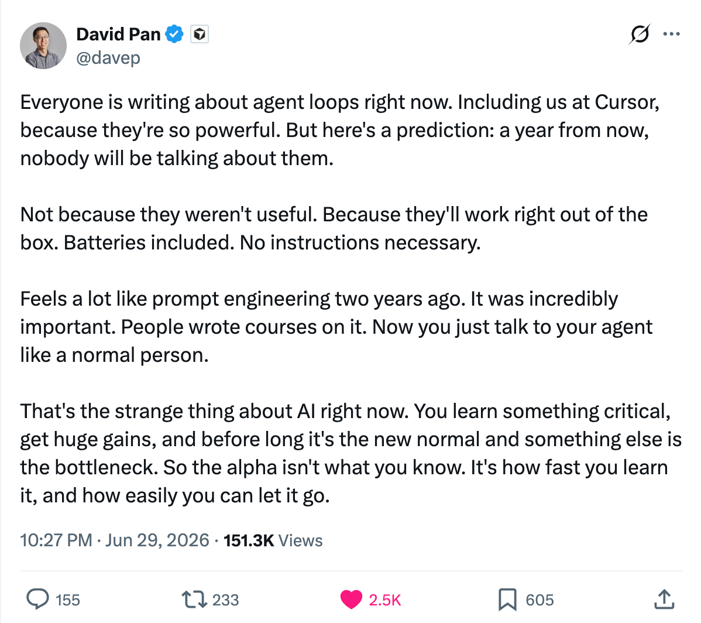

# 2026 半年回顾

创建这篇文档的时候，2026 的上半年已经到最后一天。回看这半年，感觉恍如隔世，神奇魔幻。

半年前，很多代码还是要靠手写；即使是让 agent 写，也会事无巨细地帮它探好路，再小心翼翼地 review 生成的代码。

半年前，很多事情还需要自己动手完成，“agent 做不了 PPT”，“Word 文档排版那么复杂，agent 搞不定”……

站在现在这个时间节点回想，上次手写代码，上次把 AI 当聊天 bot 用，好像已经是几年前的事情，但实际上，也仅仅过了半年多的时间。

今年一月，有幸参与了一段 agent 相关的产品/技术探索，开启了这魔幻的半年。虽然 agent 在当时已经不是一个新的概念，但大家对这个概念还都没什么认知。

第一次从 agent 开发者视角对这个概念建立认知，是通过 [Manus 被收购前的最后一次访谈](https://www.youtube.com/watch?v=UqMtkgQe-kI)。

[Manus 被收购前的最后一次访谈](https://www.youtube.com/watch?v=UqMtkgQe-kI)

三个小时的访谈，反复看了三四次，其中有些片段更是看了不下十次。最开始只觉得干货很多，现在回过头看，作为首席科学家的 Peak Ji，几乎毫无保留地把 Manus 背后的 agent 设计和思考分享了出来。

随着接触“agent 圈子”越来越深入，越来越多的概念席卷而来。如果说 2025 下半年的 AI 发展是每隔三个月就有个新概念，那么 2026 年初的新概念，几乎每个月甚至每星期都有。

先是从 agent 开发者的角度，重新认识一些“老”概念，`ReAct`，`Agent Loop`，`Tool Call`，`MCP`；再是一些半老不新的概念，`Skill`，`Memory`；还有一些之前作为 agent 用户一直在用，但作为开发者首次深入了解的概念 `Human in the Loop`，`Sub agent`，`Context Offload/Compact`，`Agent Harness`，`Evaluation`……

由于概念太多，大家在聊 AI/agent 时，可能用的是同一个词，但表达的完全是两个意思。

因此我写了一篇博客，[一文搞懂 AI agent 相关概念](https://suenyiyang.com/posts/ai-agent-concepts)，试图减少开发沟通中概念理解之间的 Gap。

然后是 ClawdBot（后更名 OpenClaw）莫名其妙火出圈，本质上看它其实和 Manus、Claude Code 之类没有区别。也许得益于交互入口可以是用户已经习惯的 IM 软件，而不是一个新的网页或者 TUI，这应该是第一次大多数非技术用户接触 agent 这种产品形态。后面还有 Hermes 之类各种各样的 agent。

当时有一个词 FOMO 很火，Fear of Missing Out（担心错过）。社交媒体上和技术圈子里，充斥着这种焦虑情绪。

所以后来我又写了两篇文章，[如何应对层出不穷的“agent”](https://mp.weixin.qq.com/s/sokCDTHeQNJsBWmaRfSGYQ) 和 [Claude Code、OpenClaw 源码浅析——如何更好地理解和使用你的 agent](https://suenyiyang.com/posts/understand-your-agents-better)，尝试从 agent 开发者的视角，揭示所谓“智能”背后的原理，减少 FOMO 情绪。

说回 agent 开发。

项目的启动阶段并不顺利。在选用 Re-Act，ReWOO 还是 Plan-and-execute “agent 架构”上纠结太久，在单 agent 还是多 agent，以及按什么方式划分 agent 上难以决策。

项目的过程也不是很顺利。想要探索和论证的技术概念太多，真正站在用户视角发现、思考、解决问题的人太少。即使单看技术，对技术概念理解的不 align，也提供了一些阻力。

> 顺便分享，有一个难回答到让我“瘫坐在椅子上”的问题，不知道各位 agent 开发者会如何回答——“Agent 是如何做意图识别的”。

项目的结局自然不必多说。虽然结果不如人意，但也算收获颇丰，因此我还是很感恩能有如此机会。

最大的收获是“要快”，AI 时代，很多东西快速做出来然后给别人用，才有可能有机会，否则过不了多久，可能就完全不用做了。

如果当时决策上没有那么多的纠结和犹豫，先怼一个凑合能用的东西上去再迭代，从项目视角看，可能会有更好的结果。

另一个收获是对 agent 发展的隐约感知——**做一个 agent 来获得产品成功的机会在缩减，更多的机会转向如何在垂直场景落地应用这些通用 agent**。

为了更系统地理解 agent Harness，也为了获得更多实践机会，那段时间我也在做一个自己的 agent 项目。

这个项目后来也没再更新了，不是因为主业项目受挫，而是已经感受到 agent Harness 以及通用 agent 能力已经完善且趋同，垂直 agent 本质只是给通用 agent 预置了垂直领域的 tool，更多的机会转向如何在垂直场景落地和应用这些 agent，创造实际价值和收益。

Cursor Field CTO 6 月 29 日也提到了类似的观点，[未来不会有人再谈论 agent loops，因为它们会变得开箱即用](https://x.com/davep/status/2071601372798316852?s=46)。

https://x.com/suenyiyang/status/2071774864244142185?s=20

作为一个垂直领域应用，做一个自己的 agent，实现一套通用 agent 所需要实现的技术架构，ROI 不高。

更合理的做法是提供工具给 agent，让它们能使用现有的系统，进而为系统创造新的增量，为用户创造更大价值。

可能这也是 Google、Lark 之类的办公领域应用都在做 CLI，并且能收获很多正反馈的原因吧。

另一个不看好“做一个自己的 agent”的原因是用户的心智模型。**用户使用产品，只关心自己的需求有没有被解决，并不关心代码是人写的还是 AI 写的，agent 背后是真人客服还是大模型。**

如果用户是懂 AI 的，那么 ta 大概率会觉得“你这个平台做的 agent 没有我自己用习惯的好用”。

如果一个用户是不懂的，那么 ta 可能用不起来，或者不能接受 agent 犯错。或者 agent 遇到问题后，不知道怎么处理，直接来 oncall。但 oncall 的解决方案可能是“agent 还没写数据，让用户新开一个对话再试试”。

当然，不做一个 agent，并不代表可以不了解 agent 原理。就像传统开发 CRUD 多多少少要了解一些计算机原理，给 agent 做工具，甚至只是想用好 agent，也需要懂一些 agent 原理。否则可能连工具都给 agent 做不明白。

 

为什么说上半年的经历神奇魔幻，因为经历了从「前端开发」到「agent 开发」到「CLI 工具开发」到「FDE（Forward Deployed Engineer）」的多次角色转变。从一个「用 agent 的」变成「做 agent 的」变成「给 agent 做工具的」再变成「帮别人用 agent 的」。

神奇的经历让我想到上半年我印象最深的两部老电影，《寒战》和《寒战 2》。

电影里有两句台词，一句是李文彬说给张国标的。

> 每一个机构，每一个部门，每一个岗位都有自己的游戏规则。不管明也好暗也好，第一步，学会它。第二步，就是在这个游戏里面玩得最好，不过很多人还没走到这一步。

另一句是蔡元祺说给李文彬的。

> 科技只是硬件，最重要的是人。

再结合看到[《代码之外》采访 Winter](https://youtu.be/MMVEspoQB8w?list=PLnLTBns4jD3WzHVN0U2D0Ac7JDtoqszIJ&t=1402) 那期。

> 新时代这些问题可能没有一个确定的答案，但是每个团队必须要交一个答卷，肯定不能让它空着上来……这个时代挺有意思的，可能不久之后又要有一个，大家都出来讲，说我在 Vibe Coding 的环境下，我们团队怎么样去解决这些问题……

我才慢慢开始理解这段神奇的经历，也后知后觉摸索到了一点点所谓的“游戏规则”。

 
最后聊聊生活上。

和女朋友去了一次南京，去了很多次西安，期待下半年一起去更多的地方逛、吃、玩、拍！

春节后到四月初，体重减了 20 斤！并且现在基本稳定在一个合理的区间。

首发抢了大疆 Pocket 4，带去露营、扫街；也用它录制，发布了两期视频。

买了大疆 Mic Mini 2，结合 Typeless 尝试语音 vibe coding，收音还不错，工位嘈杂环境小声说话也能收到。

首发入了地平线 6，下班回家在东京飙车！

 

谢谢你看到这里！
