# 一文搞懂 AI Agent 相关概念

最近在做 Agent 应用开发过程中，团队遇到了 AI 相关名词理解不对齐，沟通成本高的问题。

这篇文章主要整理 AI Agent 开发过程中，可能涉及的概念，并对每个概念做解释说明，帮助正在经历从其他方向转型 AI Agent 开发的开发者及团队，统一概念理解与沟通语言，减少误解，降低沟通成本。

主要包含 LLM、Chat bot、Agent 等概念的说明。

## LLM

LLM，英文为 Large Language Model，即大语言模型。

首先从"模型"说起，通过训练，模型具备接收特定输入，给出特定输出的能力。"语言模型"即限制了输入输出的内容为自然语言。"大语言模型"即指模型的参数量很大，例如 25 年爆火的 DeepSeek R1，其参数量为 671B。

输入给 LLM 的自然语言，会经 Transformer 转换为 token，模型内部根据输入的 token，预测应该输出什么 token，最终再将 token 转为自然语言，就是我们看到的"模型输出"。

这也是 GPT 名称的由来，Generative Pre-trained Transformer。

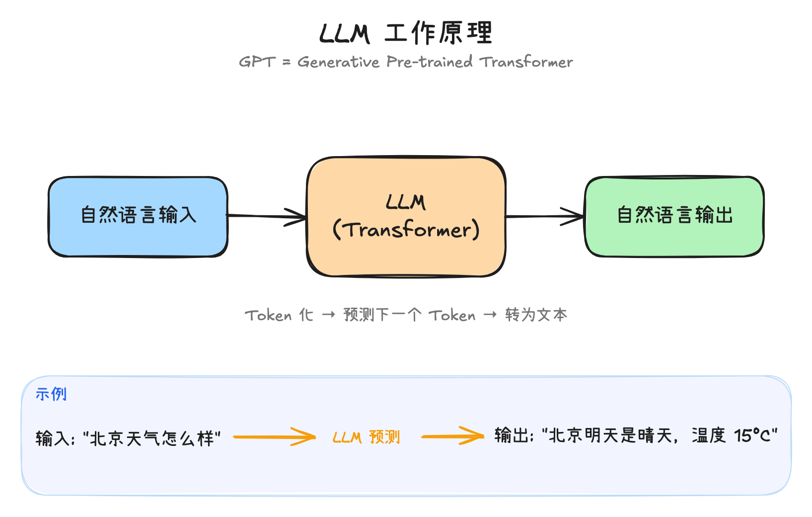

## Chat bot

早期的语言模型，擅长模仿。

当用户问它"北京天气怎么样"时，它会遵循这种模式，来预测接下来的字符。于是可能会输出"南京天气怎么样"、"成都天气怎么样"。

后来模型经过训练，可以回答用户的问题。当用户再问它"北京天气怎么样"时，它会回复一段看上去像回答的文本，给人感觉就像在聊天一样。

这就是聊天机器人，早期 ChatGPT、豆包、DeepSeek App 等 AI 助手，都可以统称为 Chat bot。

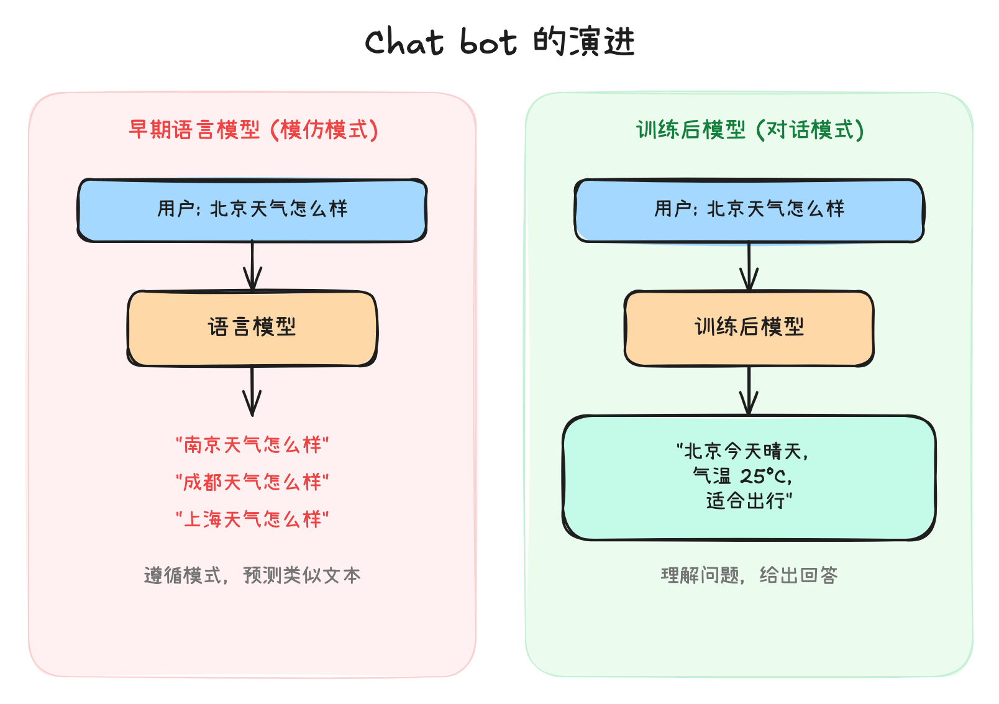

## Agent

### Prompt

Prompt，提示词。指发送给 LLM 的自然语言。

通常分为两种，system prompt（系统提示词）和 user prompt（用户提示词）。

System prompt 通常内置在 agent 中，用户不可修改，或只能通过配置的方式，追加部分内容到系统提示词中。

User prompt 通常由用户提供，但有时为了优化 Agent 能力或优化使用体验，开发者也会替用户追加 user prompt。

### Re-Act

LLM 的能力远远不止聊天，如何让 LLM 的智力和实际场景结合，完成实际落地应用，这是研究者们一直在思考的问题。

2022 年，姚顺雨的一篇论文 Re-Act 指明了方向，一个 reasoning-action-observation 的循环，奠定了目前主流 Agent 的基本架构，例如 Manus、Claude Code、Cursor 等。

还以天气问题举例，当用户问"北京明天天气怎么样"，首先，作为 LLM，它会想（reasoning）"哦，用户想知道明天天气怎么样，但我并不知道答案，我可以让用户去搜索一下"。

于是，LLM 的做出了自己的动作（action），它告诉用户"去 Google 搜索一下 '北京 明天 天气'，把结果发给我"。

用户照做，把结果发给 LLM，它就可以观察到（observation），"搜索结果显示明天是晴天"。

于是 LLM 回答用户"北京明天是晴天"。

这就是一个最简单的 Re-Act 例子。

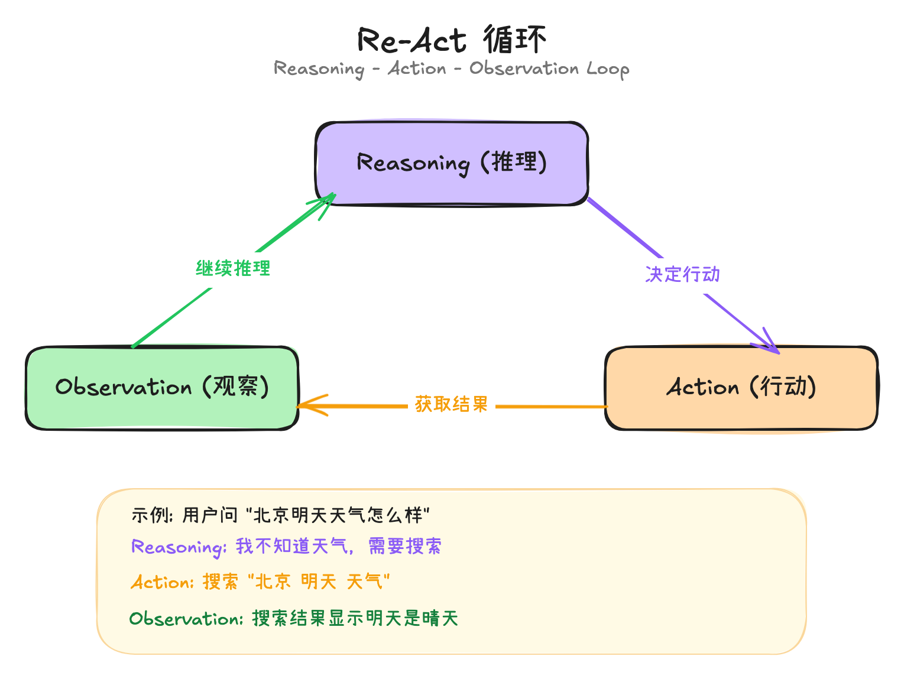

### RAG

RAG，英文为 Retrieval-Augmented Generation，即获取增强生成。

还是刚刚的例子，当用户问 LLM "北京明天天气怎么样"时，有没有什么办法可以不麻烦用户去搜索？

我们可以先**获取**北京未来 7 天的天气，把这段文本和用户的问题一起发给大模型。这样，LLM 就能直接输出"北京明天是晴天"的结果了。

这就是**获取增强生成**，先获取上下文，让模型根据上下文和问题，总结输出正确的答案。

这里还有一个容易混淆的名词，即 RAG 和向量数据库（Vector Database）。两者的关系是，RAG 的 Retrieval（获取）部分，可以通过向量数据库，来获取相关上下文，但不是必须。

例如我们刚刚举的例子，"把北京过去七天的天气情况告诉模型"，可能是一段普通文本或 JSON 数据，不一定是从向量数据库中查询得出的。

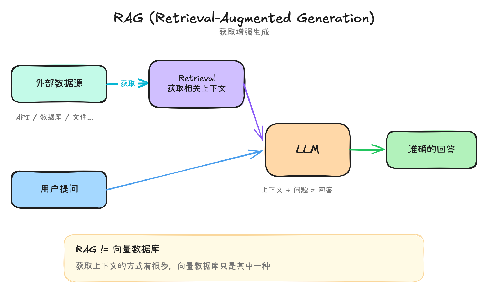

### Tool call

接着上一个问天气的例子，当用户问 LLM "明天北京天气怎么样，如果是晴天，帮我买一张天坛的门票"。

天气信息可以 RAG，但"天坛门票"没法"获取增强生成"。它会回答用户，"明天天气不错，你可以去 xxx 购买门票"。

有没有什么办法，可以让用户不用亲自去买门票呢？

我们可以提供给 LLM 一个"购买天坛门票"的工具，让模型可以告诉我们的代码，需要调用这个工具。我们在代码里执行购买门票的工具，并将工具执行结果告诉模型，比如购买成功了。

这时，模型会观察到工具调用的结果，告诉用户"明天是晴天，门票已经帮你买好了"。

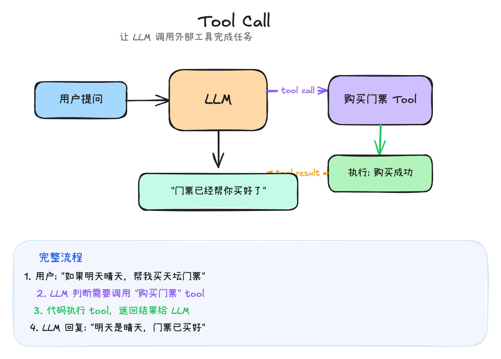

### MCP

MCP，英文为 Model Context Protocol，即模型上下文协议。

通过 tool call，我们解决了模型无法与外部系统交互的问题。但作为一个 Agent，例如 Manus，显然不应该内置一个"购买天坛门票"的 tool 给模型使用。

这时，就可以基于模型上下文协议（MCP），通过提供一个 MCP Server 的方式，让 LLM 可以调用 MCP Server 声明的 tool，实现和外部系统的交互。

请注意，MCP 本身指的就是一种协议，而不是一个工具集。

在沟通中，经常能听到这样的一些误用："MCP 协议"或"我们应该提供什么 MCP 给他们用"。翻译成中文，就是"**模型上下文协议协议**"和"我们应该**提供什么模型上下文协议给他们**用"。

这听起来太奇怪了。如果只是普通的 AI 使用者，当然没必要区分这么清楚。但作为 AI Agent 建造者（无论是否为技术岗位），都应该正确使用这个概念。

在 MCP 中，定义了三个参与者（Participants），即 MCP Host，MCP Client，和 MCP Server。

MCP Host，即支持 MCP 协议的整个应用，例如 Manus、Claude Code、Cursor。

MCP Client，实现于 MCP Host 中，用于从 MCP Server 获取可用的 tool 列表，并告诉 LLM。

MCP Server，通过标准协议提供 tool，也可以通过例如 MCP Apps 之类的 extensions，实现可交互的 UI 渲染能力。

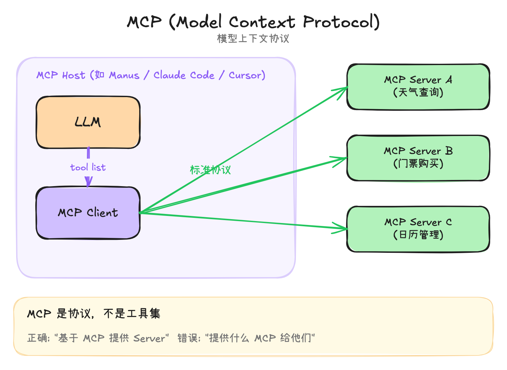

### Human-in-the-loop

首先需要理解"loop"指的是什么。在 Agent 执行任务的过程中，在 LLM 输出最终回复之前，LLM 调用 tool，tool 的结果传递给 LLM，这个过程不断循环，就是"loop"。

**那么什么是 HITL（Human-in-the-loop）？**

目前 Agent 业内对 HITL 没有统一的、明确的定义。通常情况下，在 Agent loop 中，有两种情况需要 human 参与。一是需要人工审批，一个 tool 是否应该使用特定参数被调用。一是需要人的输入，作为 tool result 存在于 LLM 上下文中。

LangChain 定义的 HITL 特指执行 tool call 之前的用户审批（确认要不要执行这个 tool）。

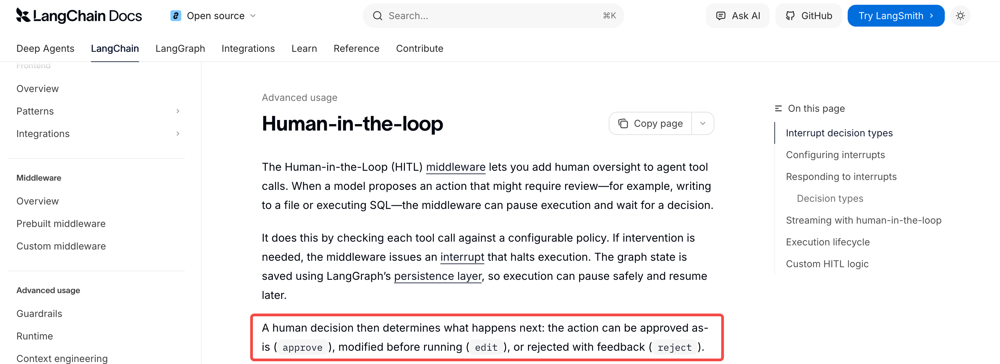

Claude 没有特别使用 HITL 这个词，而是统称为 user input。分为 `tool approval request` 和 `clarifying request`，分别对应我们上述的两种需要 human 参与的情况。

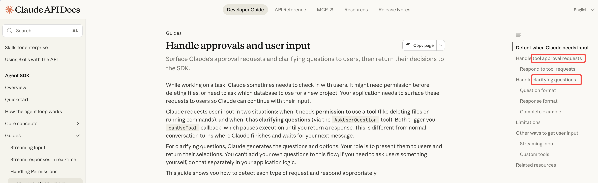

个人更倾向于 Claude 对 HITL 的定义。因为这两种本质都属于中断 Agent loop，等待用户输入，只是需要用户输入的目的以及用户输入的内容不太一样。

即 HITL 分为两种类型，一种是 **Human as gatekeeper**（守门员），另一种是 **Human as tool**（作为提供信息的工具）。

两种 HITL 区别如下。

|                   | Human as gatekeeper              | Human as tool               |
| ----------------- | -------------------------------- | --------------------------- |
| 触发                | 基于规则                             | LLM 通过 tool call 触发         |
| Human 职责          | Approve / Reject / Edit（通常不建议使用） | 提供信息、澄清需求、做出选择等             |
| 目的                | 安全和控制，防止意外的副作用                   | 人与 LLM 协作，补齐 LLM 上下文        |
| 在 Agent loop 中的位置 | LLM tool call 之后，tool 实际执行之前     | 与人交互是 tool 的执行过程            |
| 与上下文的关系           | 不一定存在于上下文中                       | 人的输入是 tool result，一定存在于上下文中 |

**为什么需要 HITL？**

首先是 Human as gatekeeper。

以 Claude Code 之类的 Agent 举例，这些 Agent 有 Bash tool，某些 Bash 命令可能有操作风险，比如 `rm` 命令。在 LLM call Bash tool 之前，需要人工确认，是否同意用 xxx 参数，调用 Bash tool。这就是需要 Human as gatekeeper 的原因。

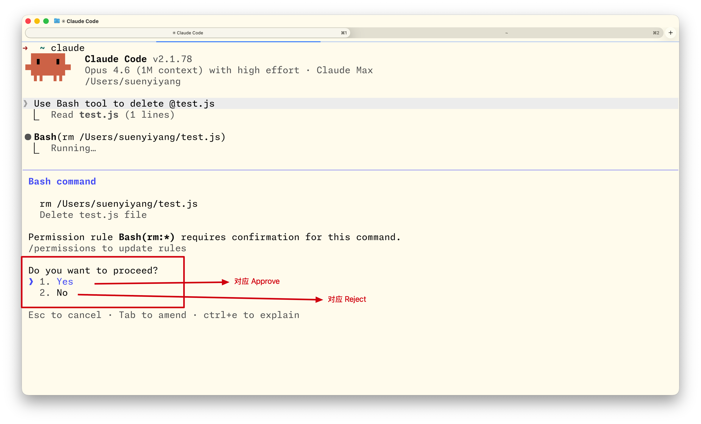

其次是 Human as tool。

以 Claude Code 中 AskUserQuestion tool 为例，Agent loop 中，LLM 需要用户提供额外信息，可以通过这个 tool，要求用户输入。用户的输入会作为 tool result 存在于 LLM 上下文中，LLM 通过观察 tool result，再规划下一步的 action。

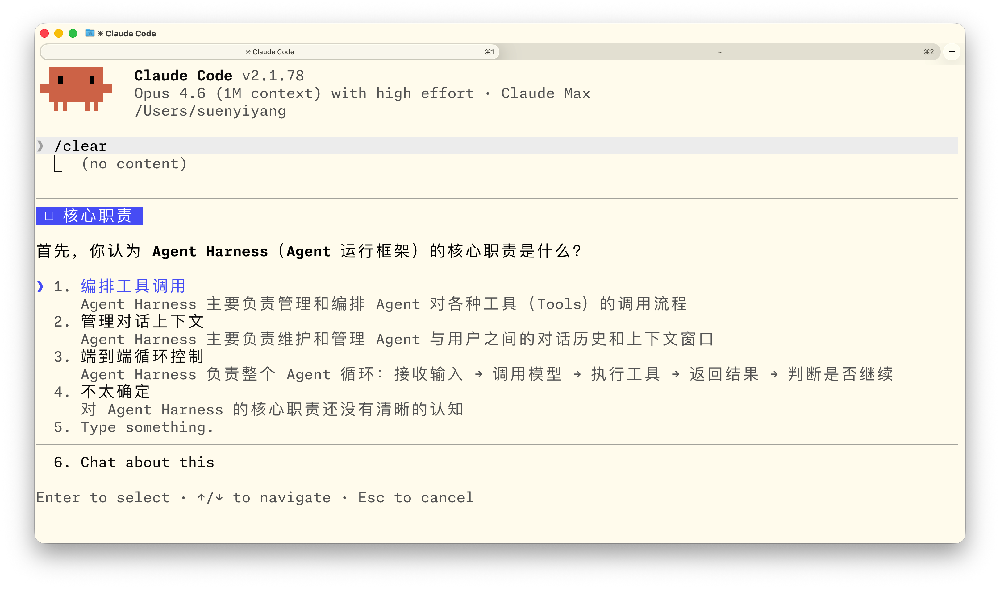

**对用户来说，两种 HITL 的输入输出分别是什么？**

首先，Human as gatekeeper。

基于规则触发，因此给用户的输入应该是预先确定的三类选项，同意（Approve）、修改（Edit）和拒绝（Reject）。常用的是 Approve 和 Reject。Edit 由于会修改 tool call 的参数，可能会造成 LLM context confuse，通常不建议使用。而用户的输出就是决策 Approve 还是 Reject 这次 tool 的执行。

如果用户 Approve，则 tool 会完成执行，并将获取到的结果，作为 tool result 给到 LLM 的 context list 中。

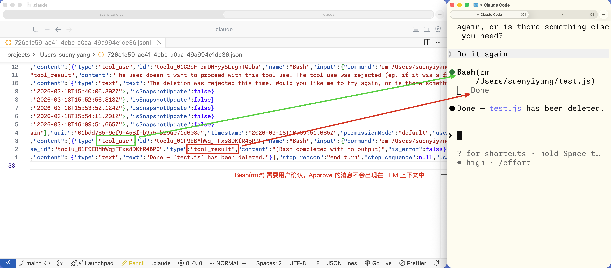

如果用户 Reject，则 tool 不会实际执行。Agent 开发者会构造一条 tool result，告诉 LLM 这次执行被拒绝了，LLM 会基于这次 action 的结果，做观察，规划下一步的 action。

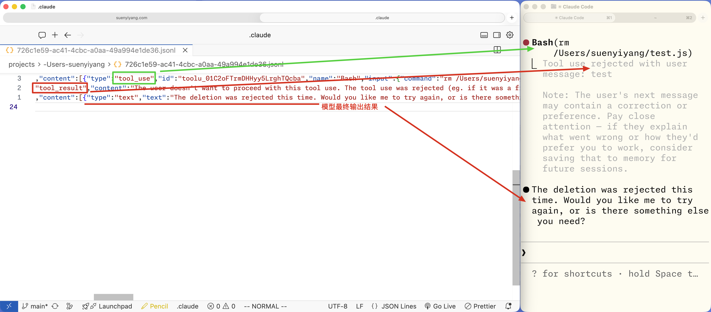

其次，Human as tool。

基于 LLM 的 tool call 触发，这种 HITL 的触发与否、触发时的数据内容都是不确定的。我们只能通过 JSON schema，定义这个 tool 的入参数据结构。

对用户而言，接收的输入是模型生成的、符合特定数据结构的自然语言。而用户的输出，通常同样是自然语言（也可能会支持多模态）。

需要注意的是，有另一种交互，同样需要用户输入信息，特别容易和 HITL 混淆，但它不是 HITL。仍然以 Claude Code 举例，即是 Claude Code 输出的最终结果中要求用户输入的问句。**它本质只是 LLM 的最终输出结果。**

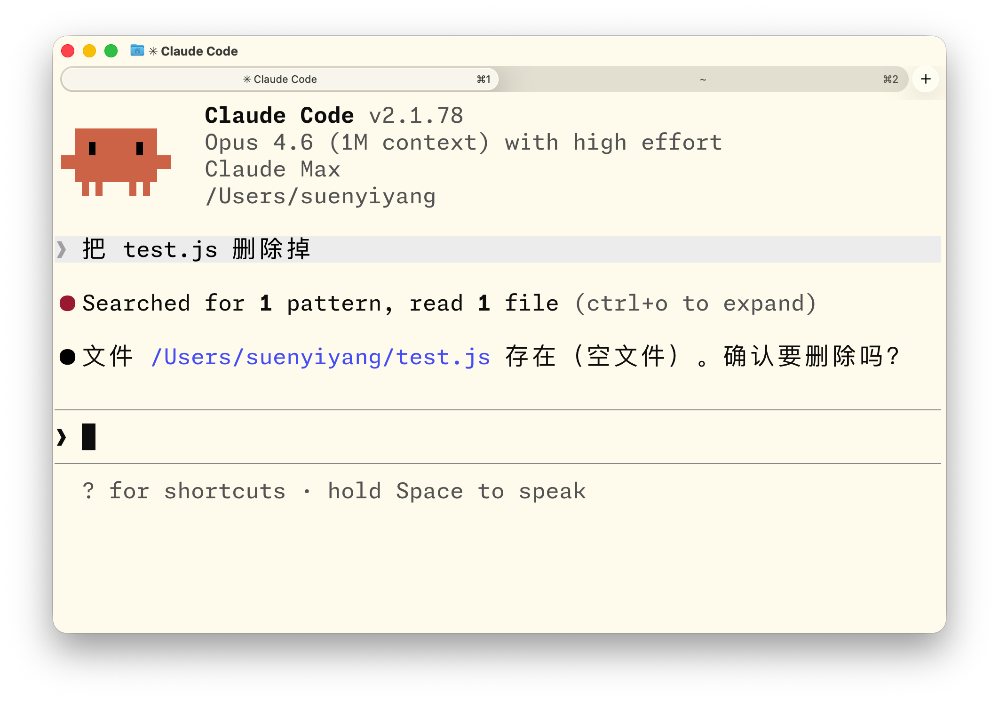

此时，一轮 Agent loop 已经结束，用户再次输入消息发送给 Agent，会开启下一轮的 Agent loop（同一个会话内，携带历史上下文）。**因此，这种交互不是 HITL。**

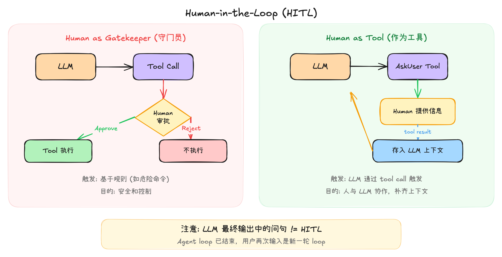

### Context Engineering

Context Engineering，即上下文工程。

在 Agent loop 中，system prompt、user prompt、一轮一轮的 tool call 和 tool result，会快速填充上下文。但 LLM 的 context window（上下文窗口）是有限的，现在的大模型 context window 通常为 200K tokens，部分模型支持 1M tokens。

因此，需要做上下文工程，对 LLM 接收的 context list 进行控制。

上下文工程可能有很多不同的手段，但万变不离其宗。下面将介绍几种常见的概念。

### Agent Skills

这是 2025 年 10 月发布至今，AI 相关圈子内最火的名词之一。特别是"养虾"热潮之后，更是将这个名词的热度炒到了巅峰。

经常能听到这样的言论："给你的龙虾一个 xxx skill，它就能 xxx 了"。听起来似乎 skill 能解决所有问题。

**但究其本质，Skill 到底是什么，为了解决什么问题？**

我们可以接着刚刚"查天气"和"逛天坛"的例子。我们给了 LLM 查天气和买门票的 tool，LLM 只知道这两个 tool 的参数数据结构，不知道要怎么使用这两个 tool，才能满足用户的要求。

这时，可能有几种解决方案。

一是做一个"旅游 Agent"，在 system prompt 里告诉 LLM 怎么使用这两个 tool。但这个 Agent 无法完成其他任务；或者说要完成其他任务，需要修改 system prompt。有可能修改后，更多的上下文 confuse 了 LLM，导致什么任务都无法完成。这个解决方案不可行。

二是某些 Prompt 高手用户，会手动告诉 Agent，应该怎么使用这两个 tool。这是很长一段 user prompt，每次都输入很麻烦，而且用户很难管理这段 Prompt 模板。

有没有什么更优雅的方式呢？Claude Skills（后来发展为 Agent Skills 标准）应运而生。

所以 Skill 本质就是一段 prompt 模板。为了解决动态注入上下文的效率问题。

至于"上下文渐进式披露""脚本执行能力"，这都是基于 LLM 能调用 Bash tool，自然而然的收益。

即使不遵循 Skills 规范，在一个 markdown 文件里提及另一个 markdown 文件，LLM 也会在需要的情况下，读取对应的 markdown 文件，做到渐进披露上下文。

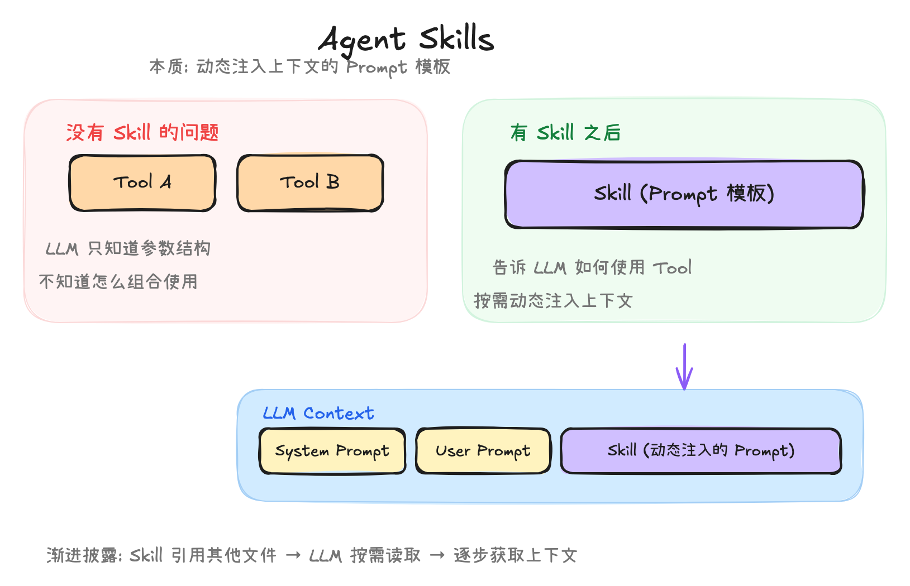

### Memory

Memory，记忆，通常分为短期记忆和长期记忆。

短期记忆很好理解，同一个会话中，几条消息之前，用户给 LLM 说了什么，LLM 给我回复了什么，希望在这次新发消息时，LLM 还有上下文。通常在用户新发消息时，把历史消息带给 LLM 即可实现。

长期记忆通常是指跨会话的上下文传递。例如用户在会话 1 中告诉 LLM 他是一名程序员，在会话 2 中，他希望不用再次提及，LLM 也可以知道他是程序员。

要满足这个需求，最简单的实现是在会话 2 中，把会话 1 的历史消息也告诉 LLM。但这样做会引入其他问题，因为会话 1 和 2 可能完全是不同的话题，可能会 confuse LLM。

通常在 Agent 中要实现长期记忆，会在用户给 LLM 发送 prompt 时，追加一个外挂的步骤：提取值得作为长期记忆的信息，存储起来；同时，提取之前存储的长期记忆中，与本次任务相关的部分，替用户追加到 user prompt 里。

这样，看起来 Agent 就具备了长期记忆能力。但实际上，只是 RAG 的一种实现方式。

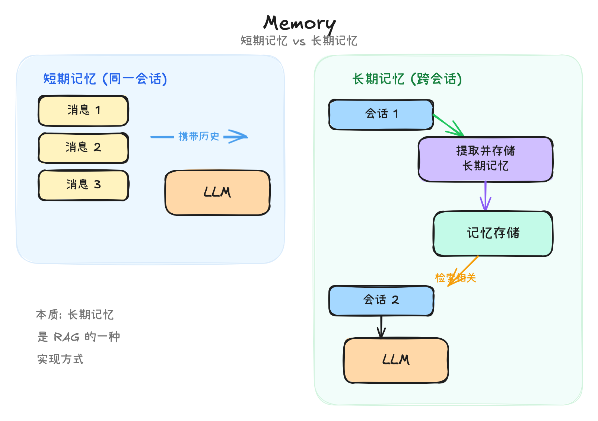

### Sub-agents

> 不要把"人"生而为人的限制，生搬硬套给 Agent。—— Peak Ji from Manus

首先，需要明确，sub-agent 最大的作用，是隔离上下文，而不是"过家家"。

在解决一些长难任务，需要基于 wide 和 deep research，获取充足上下文的基础上，再开始完成任务。

如果不考虑 sub-agent，所有的上下文都在同一个 LLM 的 context list 中，有可能上下文快速积累，导致 research 还没做完，就达到 LLM 的 context window 限制，长难任务无法被完成。

但重新观察填满 LLM context window 的上下文，可能很多都是与完成任务本身无关的，可能只需要这些上下文，给出一个能或不能做某件事的结论。这些上下文不出现在 LLM context window 中也可以，只要有最后的结论即可。

这时，就适合使用 sub-agent，sub-agent 会维护一个单独的 context list，把不必要的出现在主 agent 中的上下文隔离出来，只告诉主 agent 最终的结论。这样，主 agent 的上下文中就不会出现与完成任务本身无关的部分了。

前段时间 OpenClaw 爆火，有人设计了一个"三省六部制"的 Agent 体系，这就是一个使用 sub-agent 来"过家家"的例子，是 sub-agent 使用的反例。

首先，对于"过家家"中的每个角色，可能仍然会遇到需要 wide / deep research，上下文快速填满，无法继续"过家家"的问题。

其次，不同 agent 之间上下文的传递、共享，以及它们之间的交互方式，是一个复杂工程。人和人之间的沟通尚存在这么多上下文的不对齐和误解，没有合理的设计，agent 之间的上下文也会有很多 gap，导致整个系统的效果大打折扣。

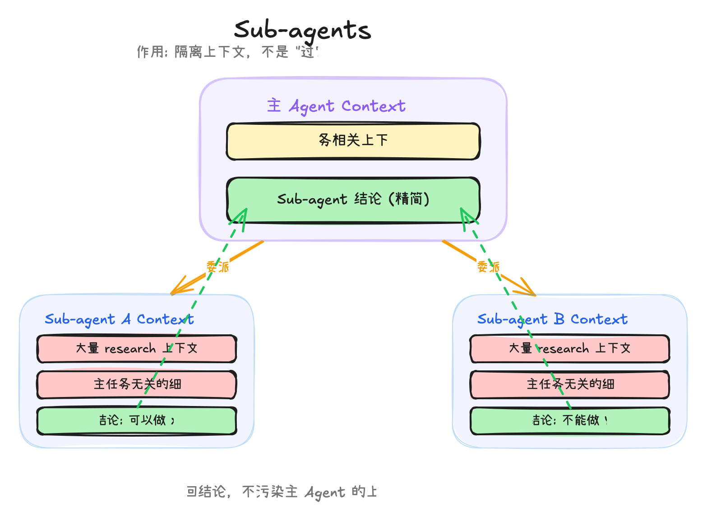

### Context Offload / Compaction

即使通过合理拆分 sub-agent，可以规避一部分 context window 限制的问题，但对于长难任务而言，这可能是不够的。

并且，对于 LLM 来说，并不是 context window 完全填满才会影响输出，当上下文达到一定长度时，LLM 会感受到 context pressure，输出 end of sequence token 的几率会显著上升。表现为输出质量断崖式下降，开始疯狂输出 bullet list，开始倾向于写总结性的句子，并且写短。

所以需要通过上下文卸载（Offload）、压缩（Compaction）来解决这个问题。

在长难任务中，Agent 上下文可能有一部分在使用过后，就不再有必要了。例如 Coding Agent 读了文件 A，但后续的操作不需要文件 A 的内容在 context list 中。

此时，可以通过修改历史消息，把原本文件 A 的内容，替换为告诉 LLM，文件 A 的内容在硬盘 xxx 位置，如果有需要可以重新读取。这就是上下文卸载，把 context list 里的上下文，通过一个 file system（可能是本地，也可能是沙盒），卸载到外部，有需要时再重新加载。

随着上下文的累积，卸载可能也无法满足要求，这时可以对历史的上下文进行总结，用总结后的文本代替所有的历史上下文。这就是上下文压缩。

上下文卸载可以视为一种无损的 context window 释放方式，因为历史上下文并没有丢失，随时可以重新加入 context list 中；而上下文压缩通常是有损的，历史上下文中的一些细节，可能在总结的过程中，被丢弃掉。

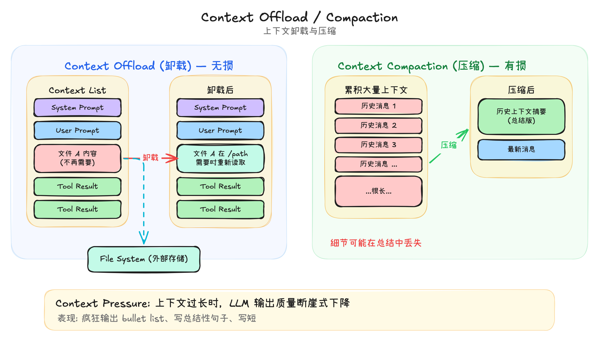

### Harness

Harness，中文原意为"马缰""缰绳"。在 Agent 中，LLM 就是一匹马，除了 LLM 的一切都是 harness。给 LLM 设计的 tool、所做的上下文工程，都是 harness 的一部分。

Harness 相比于 Framework（框架），抽象层级更高。Framework 只提供了制造马缰的方法，而 Harness 才是完整的马缰。

例如 LangChain 相关的包中，LangGraph 是底层的流程控制 Framework，LangChain 是 Agent 相关的 Framework，而 DeepAgents 是 Agent Harness。DeepAgents 在 LangChain 的基础上，提供了内置 tool 以及上下文工程相关的封装，因此它是 Harness 而不是 Framework。

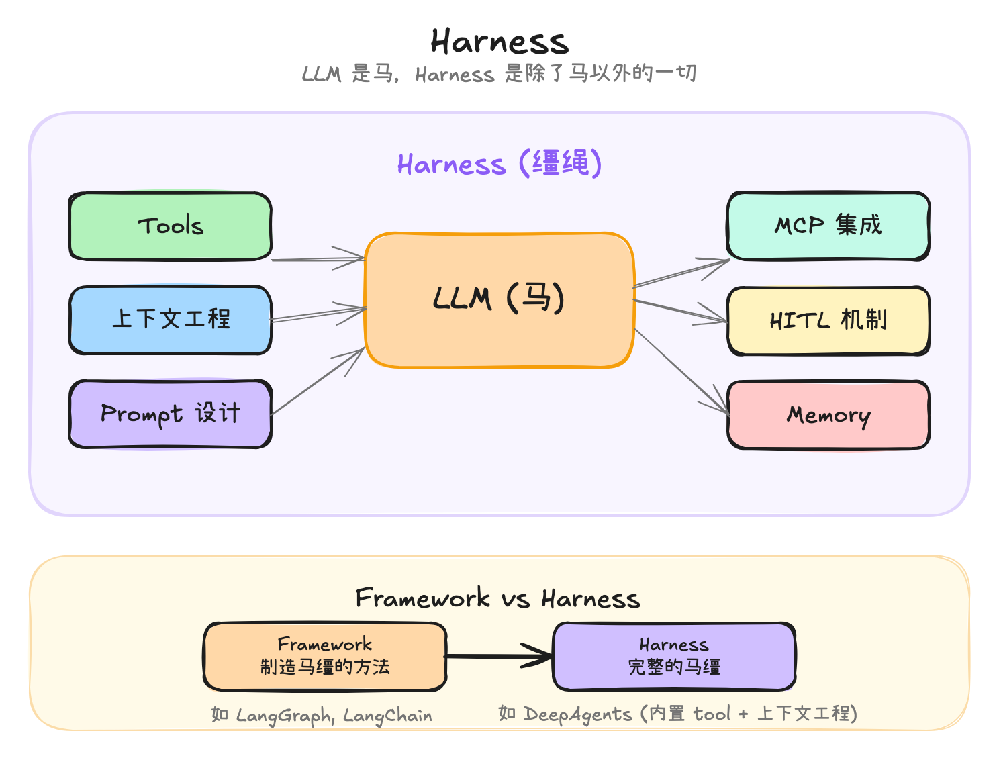

### Trace & Evaluation

Agent 开发与传统软件开发最大的不同是，传统软件开发中，软件的极大部分逻辑是写在代码里的，数据从哪来，传递什么参数给哪个函数，先执行什么函数，再执行哪段逻辑……这些都是写在代码里的；而 Agent 开发中，由于函数执行是通过 LLM 返回的 tool call 以及对应参数触发，所以直到 Agent 实际上线运行之前，开发者都无法知道 Agent 会如何表现。

因此，trace（追踪）& evaluation（评估）在 Agent 开发中特别重要。一次线上的问题排查，我们需要知道中间执行了哪些 tool call，其中哪些是不符合预期的；一次代码或 prompt 的变更，我们需要在上线前评估出会对 Agent 在各个方面的表现产生什么影响。

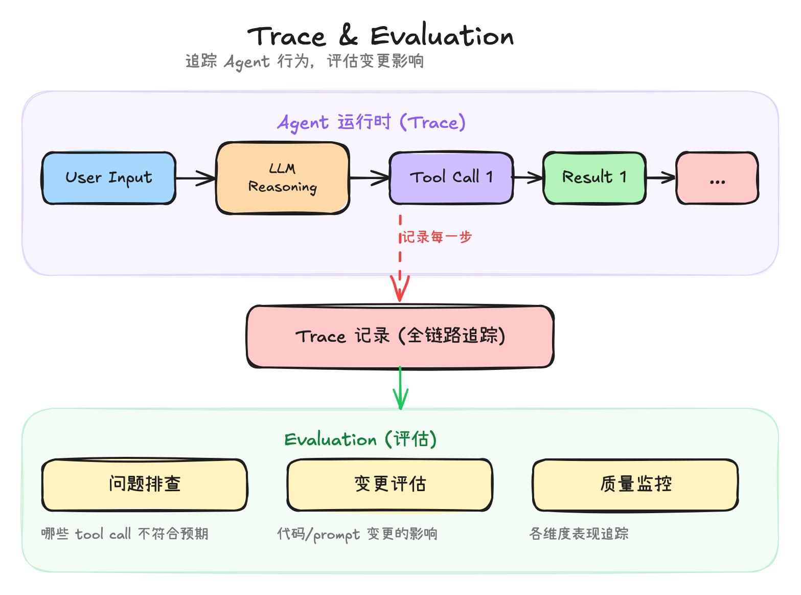

## 一些个人思考

### Workflow vs Agent

Workflow（工作流）是指执行逻辑和步骤由代码提前定义好的系统。

Workflow 中可能也涉及 LLM 节点，但大多的功能是做意图识别、信息提取、总结输出等工作，工作职责确定，功能单一，不需要或很少需要给 LLM 提供 tool，只需要提供 prompt 即可。

可能有人会把包含 LLM 的 Workflow 称作"Agentic Workflow"，我的观点是不管前面的形容词怎么加，都还是 Workflow，和 Agent 完全是两个东西。

Agent 是指执行逻辑和顺序由 LLM 通过 tool call 动态控制的系统。与 Workflow 最大的区别是「逻辑通过代码预先定义」还是「逻辑通过 LLM 的 tool call 动态控制」。

因此，Agent 的主体代码逻辑通常很简单，以 OpenClaw 的底层依赖 pi-agent 代码为例，只有两层循环。外层循环处理等待中的 message，阻止 agent loop 结束；内存循环处理一轮 agent loop 中的 tool call 和 messages。

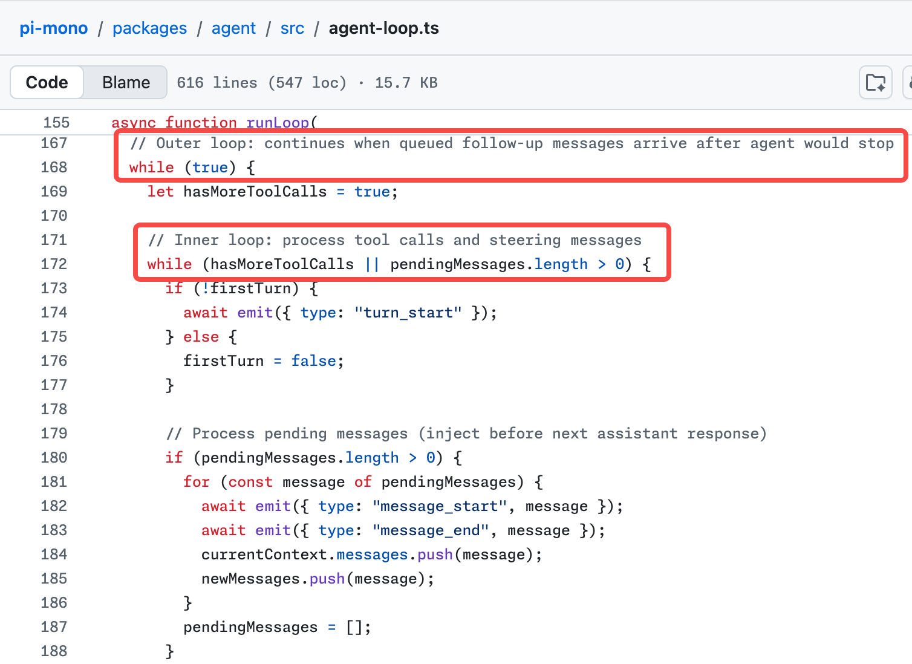

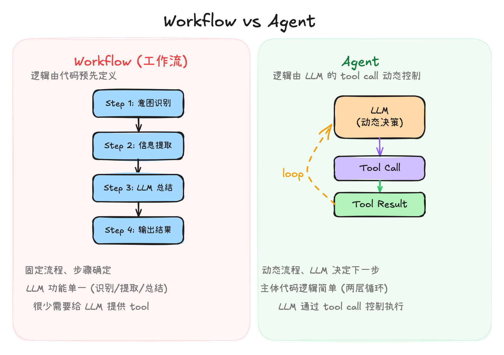

### 通用 Agent vs 垂直 Agent

首先，区分通用 Agent 和垂直 Agent，主要应该从 Agent 的输入输出方面入手。

对于通用 Agent，例如 Manus、Claude Code、Cursor 之类，它们把更多输入输出的责任交给了用户。

作为用户，在输入方面，需要配置各类的 MCP server、skill，甚至需要开发一些 MCP server 或 CLI 工具，让这类通用 Agent 能够和现有的系统进行交互。在输出方面，通常输出只会在通用 Agent 自己的平台上，如果需要输出到其他系统，例如飞书、Telegram 或其他内部系统，需要做额外的配置，或者有一定的适配开发工作量。

对于垂直 Agent，会替用户承担更多输入的责任，并且在输出上也可能与通用 Agent 不同。

以 Notion Agent 和 Figma Make 为例，作为垂直 Agent，它们替用户内置了操作 Notion 和 Figma 的 tool，可以减少一部分需要用户输出的工作。在输出上，Notion Agent 的输出会直接体现为文档的编辑结果；Figma 的输出会直接体现为设计稿。

而输入输出的不同，通常在技术实现上，体现在给 Agent 设计 tool 的不同。

因此，垂直 Agent 和通用 Agent，在技术架构上是趋同的，主要区别可能只在内置的 tool 不同。

这就有另一个问题了，作为 Notion、Figma 以及诸如此类的"工具类"平台，应该给通用 Agent 做工具，还是应该做自己的 Agent？

我的观点是应该做自己的 Agent，但同时也应该给通用 Agent 做工具，两者并不冲突。

首先从用户视角看，用户为 Notion / Figma 付费后，需要再买个 Manus 或 Claude Code 的会员，才能用 Agent 能力，体验上会很奇怪。所以应该做自己的 Agent，至少让只需要使用这一个工具的用户，可以在同一个平台内，拥有完整的使用体验。

其次，面向未来地看，未来大部分软件，其用户可能更多是 Agent 而非人类。通过 MCP server 或 CLI 这种能方便 Agent 使用的工具，是一个软件未来还能有足够用户的基础。所以同时应该给通用 Agent 做工具。

至于从商业视角看，应不应该自己做 Agent，这个存疑。因为截至 2025 年底，即使是 Manus 这样成功的 Agent，还是在花钱贴补用户体验 Agent 这种产品形态，至少目前做 Agent 还不算 token 低买高卖的赚钱模式。

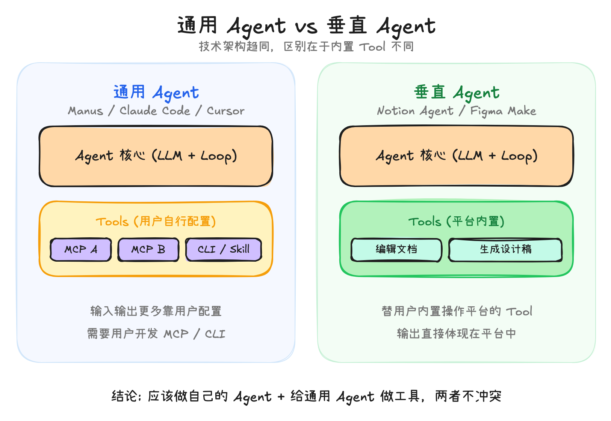
