# OpenClaw？DeerFlow？Hermes Agent？如何应对层出不穷的“Agent”

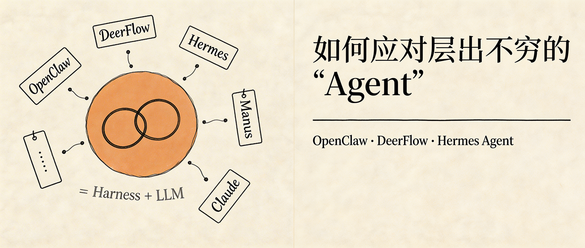

前两天，社交媒体和工作群里，又出现了一个新的概念，Hermes Agent。

从 2025 年底的“Clawdbot”火出圈（后更名 OpenClaw），到前段时间 DeerFlow 刚刚在圈子里又小火了一把，再到最近的 Hermes Agent，新名词出现的传播的速度让人应接不暇。再结合一些营销号的鼓吹，难免会让人 FOMO（Fear of missing out）。

从一个 Agent 开发者的视角看，这些 Agent **万变不离其宗**。今天就从概念到核心源码，深入浅出地聊聊哪些可以「万变」，哪些是不变的「其宗」。

## 厘清基本概念 Agent / Harness / Framework

先来区分 3 个基本概念，Agent / Harness / Framework。先用一张图展示它们之间的关系。

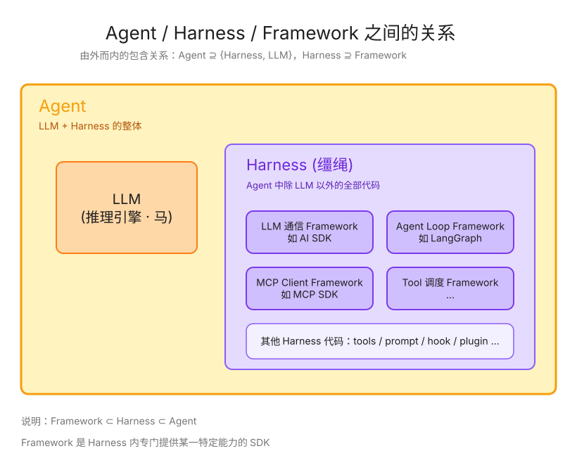

然后是 Agent，无论是 Manus Agent，Claude Agent 还是 OpenClaw 之类，Agent 的核心就是姚顺雨的那篇 Re-Act 论文。基于 LLM 的推理（reasoning）、和 tool call（action）能力，写各种代码为 LLM 提供工具以及设置约束。

接下来是 Harness，简单来说，Agent 中除了 LLM，其他的部分统称为 Harness。即 `Agent = Harness + LLM`。以 Claude Agent 为例，`askUserQuestion` tool、MCP client、`Skill` tool 以及所有给 LLM 提供上下文和提供约束的代码，统称为 Harness。

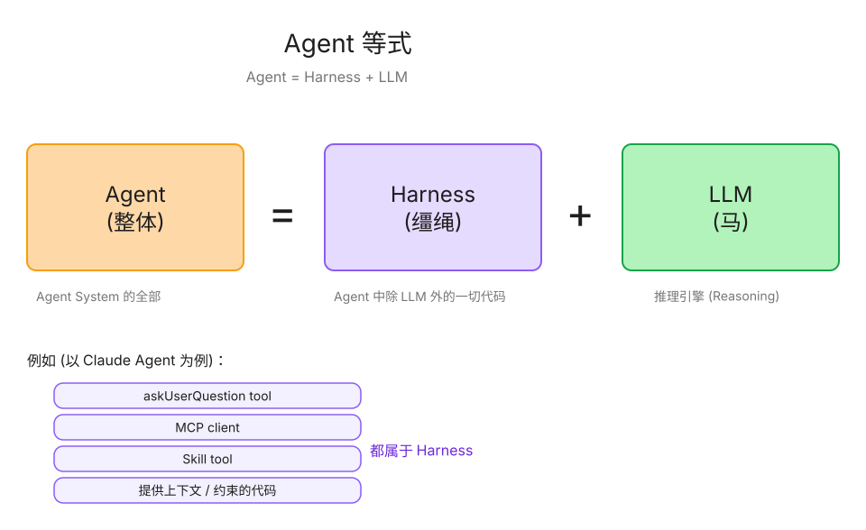

最后是 Framework，在 Harness 中，专门提供某一特定能力的 SDK，被称为 Framework。例如专门处理与 LLM 通信的 Framework、专门处理 Agent loop 的 Framework 等。

> 关于 Agent 的其他概念解释，可以参考另一篇文章《一文搞懂 AI Agent 相关概念》。

## 一个 Agent system 由哪些部分组成？

所有的 Agent system，不管是 OpenClaw、DeerFlow、Hermes Agent 还是 Manus、Claude，都可以看作由三部分组成：与用户交互的前端、管理用户信息和消息的后端以及 Agent harness。

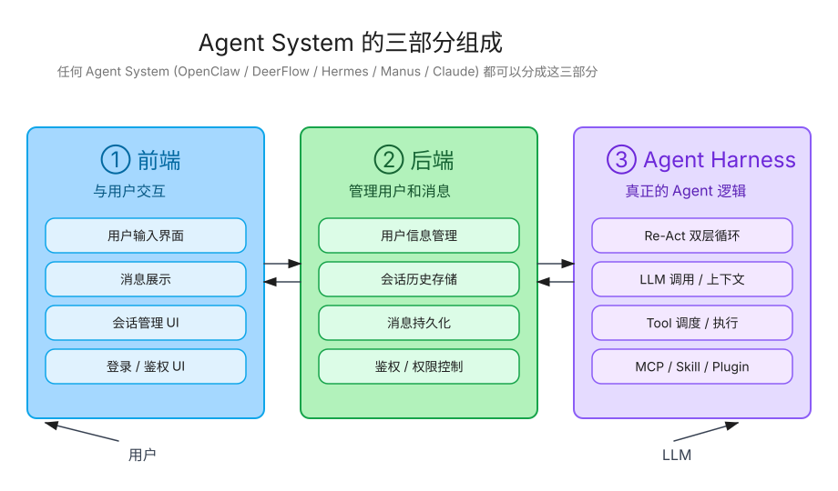

对 OpenClaw 和 Manus 之类的 Agent system 也不例外，区别只在于这三层的表现形式是什么。

对 OpenClaw、DeerFlow 和 Hermes Agent 来说，用户交互前后端的部分使用 IM 软件替代了，它们只专注实现 Agent harness 的能力。

简单来说，相当于在用户的电脑或服务器上，运行了一个符合飞书、Slack 等 IM 软件机器人协议的应用程序，用于把用户消息转发给 Agent harness，并将模型的输出通过机器人发给用户。

而对于 Manus、Claude 来说，它们在实现 Agent harness 的基础上，自己实现了一套用户交互的前后端，用来管理用户登录状态、会话和消息历史记录等，没有依赖传统 IM 软件的能力。

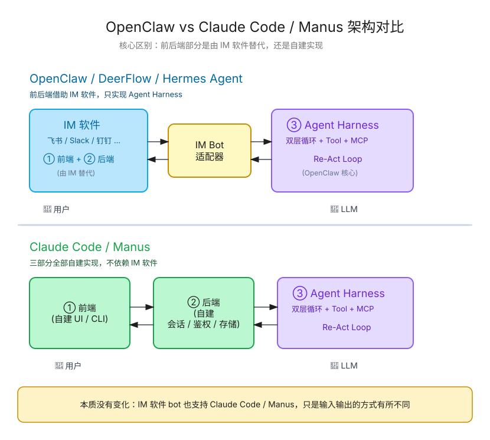

现在 Manus、Claude Code 也支持了连接 Telegram 之类的 IM 软件，**其本质没有变化，只是在输入输出的方式上有所不同**。

以 Claude Code 为例，通过绑定 IM bot，获取用户在 IM 软件中的输入；再通过 MCP server tool，把看上去像回复用户的消息，通过 IM bot 发送给用户。

## 所有 Agent harness 最核心的代码

了解了 Agent system 最核心的三个组成部分，在用户交互前后端上可能会有不同，但 Agent harness 是一致的。

Agent harness 中有什么是不变的呢？Agent 通过 Reasoning-Acting-Observation 循环的工作方式是不变的。

所以，深入每个 Agent 的源码，你总能找到类似的“双层循环”。

```伪代码
当「有待处理的用户消息」时循环：
  1. 发送用户消息给 LLM
  2. 获取 LLM 输出
  3. 当「输出有 tool call」时循环：
     a. 执行 tool call，把结果发给 LLM
     b. 获取 LLM 输出，若有新的 tool call，继续循环；若没有，跳出当前循环
```

以热度更高的 OpenClaw 和 Hermes Agent 的源码举例。

OpenClaw 底层依赖 `pi-agent`，它的双层循环在 `pi-mono` 仓库中。

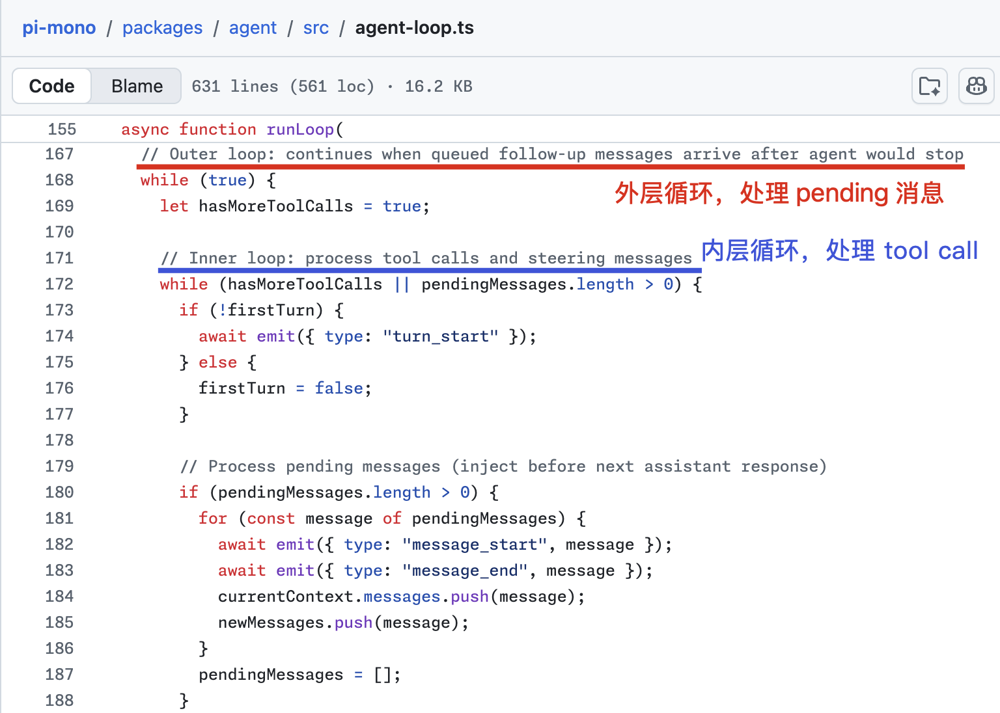

Hermes Agent 的代码实现有些区别，只用了一层 `while` 循环，通过 `continue` 语句，在有 tool call 时让循环不跳出，可以视作实现了双层循环。在 `run_agent.py` 的 `run_conversation` 方法中：

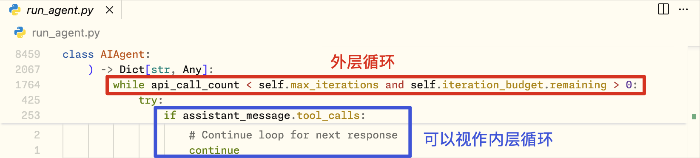

由 Re-Act 的范式决定，所有 Agent 的本质就是上述这样的“双层循环”。其他的工程复杂度，全都在于：

1. 怎么提供内置的 tool，提供什么样的内置 tool；
2. 对 LLM 做什么样的限制，让输出更符合预期；
3. 支持什么样的能力（如 MCP client、Skill loader 等），让用户可以更方便得给 LLM 提供上下文；
4. 支持什么定制化能力，例如 plugin 或 hook；
5. ……

## Hermes Agent 如何实现“自我进化”？

既然所有 Agent 的本质都是上述的双层循环，那 Hermes Agent 和 OpenClaw 又有什么区别呢？他们宣传的核心——“**The self-improving AI agent**”又是怎么实现的呢？

借用 Manus 首席科学家 Peak Ji 在采访中的一句话来回答，“Agent 之间的区别主要是**输入输出不同**”。

对 LLM 而言，获取输入的途径，除了 System Prompt 和 User Prompt，最核心的就是 **Tool**。也就是说，**不同的 Agent，本质是预定义的 Tool 不同**。

深入 Hermes Agent 的源码，它是如何实现“自我进化”，特别是如何自动从任务中沉淀 Skill 的呢？本质上，**只是在代码中给 Agent 提供了一个预置的 `skill_manager_tool`**，围绕这个 tool 做了一些工程上和 prompt 上的额外工作。

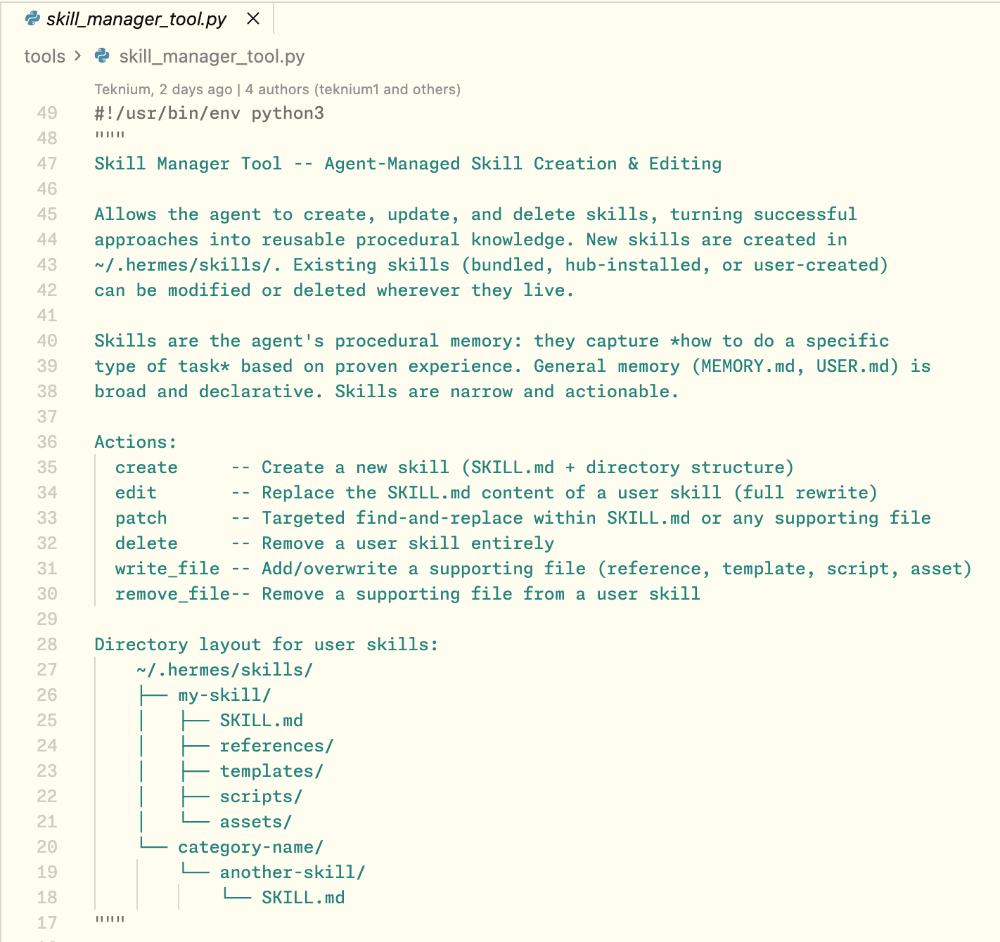

这个 tool 的参数以及核心代码实现如下：

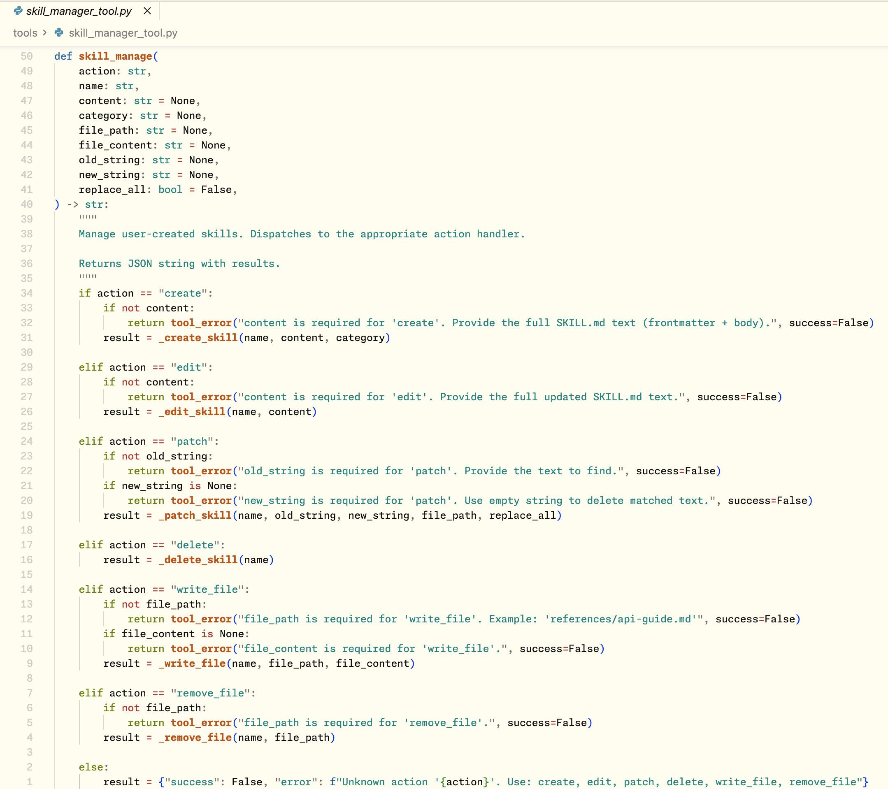

只有这一个 tool，不足以保障 Hermes Agent 的“自我进化”能力。有可能 LLM 在一轮对话中没有 call 这个 tool，也可能基于一轮对话过程中的上下文，对 skill 的管理有误。

因此，为了这个“核心卖点”，Hermes Agent 还在一轮 Agent loop 结束后，启动了一个单独的线程来 Review 这轮对话中 Skill（包括 Memory）的管理。

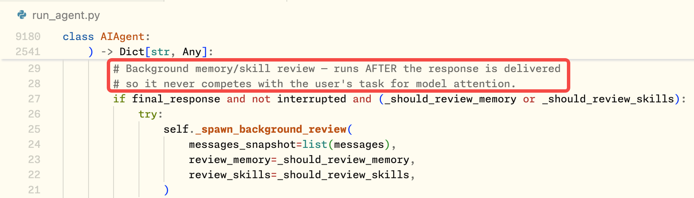

在单独的线程中，使用特定的 Review Prompt，一个单独的 Agent，review 刚刚结束的对话。

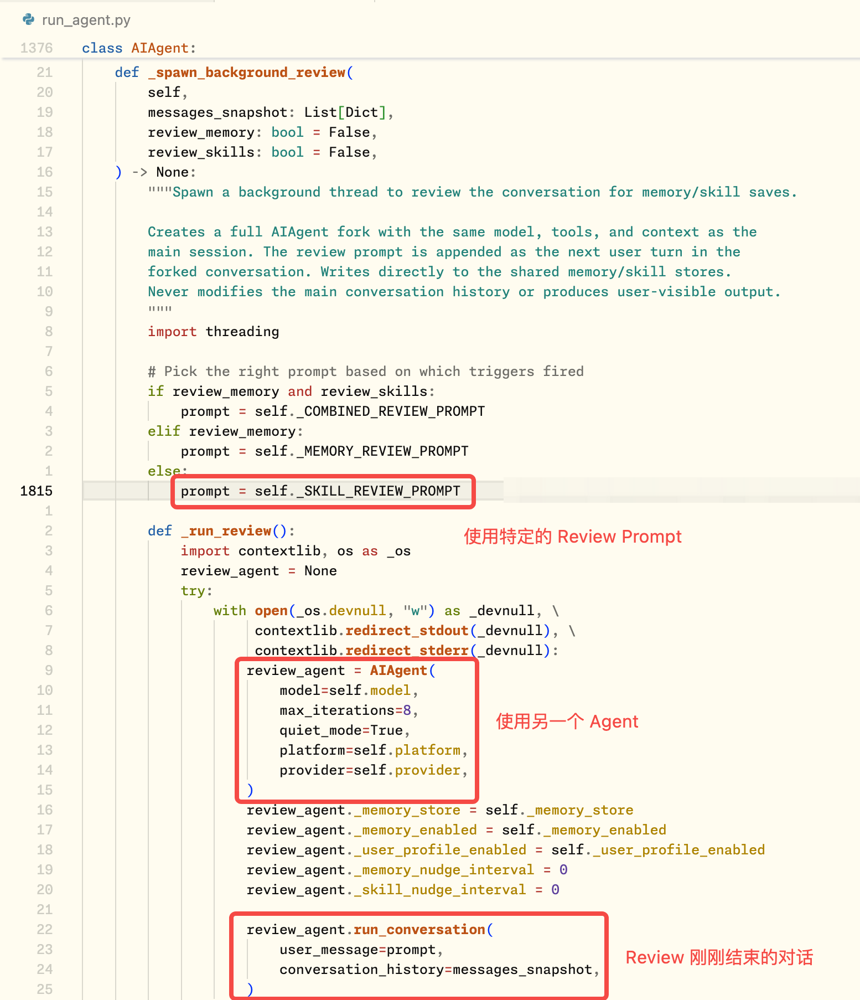

看一下 `SKILL_REVIEW_PROMPT` 内容：

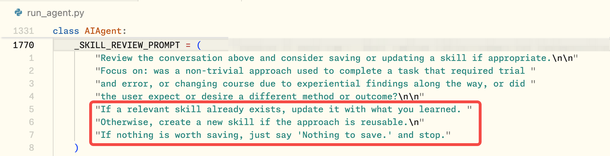

> 如果已经存在相关 Skill，就把你学到的内容更新进去。
> 否则，如果这种方法具有可复用性，就创建一个新 Skill。
> 如果没有任何值得保存的内容，就直接说“Nothing to save.”并停止。

## 如何应对层出不穷的“Agent”

理解了 Agent 最核心的部分是双层循环，理解了不同 Agent 最本质的区别只是预置的 tool 不同，再遇到层出不穷的各种 Agent，就能快速了解其噱头背后，与已有的 Agent 有什么不同。

像 Hermes Agent 这样，默认提供了 Skill / Memory 管理 Tool 的 Agent 可以声称是“自我进化”Agent，那么——

- 默认提供了天气查询 Tool 的 Agent 就可以称为“天气 Agent”；
- 默认提供了操作财务系统 Tool 的 Agent 就可以称为“财务 Agent”；
- 默认提供了操作人力资源系统 Tool 的 Agent 就可以称为“HR Agent”；
- ……

所以，**领域 Agent 和通用 Agent 在技术架构上是趋同的。**

想要构建什么特殊的，或垂直领域的 Agent，只需要考虑如何在通用 Agent 的基础上，提供领域专用的 Tool 即可。

或许这就是为什么 Anthropic 要推出「Managed Claude Agents」——减少通用 Agent 的技术架构给领域 Agent 初创团队带来的心智负担，让他们更专注给 Agent 构建 Tool 和使用这些领域 Tool 的 Skill。

最后，更进一步思考，如果给 Claude Code 管理 Skill 和 Memory 的 tool；再结合 hook 能力，在一轮 Agent loop 结束后，启动另一个 Claude Code 实例对上一轮对话做 review 并更新 Skill 和 Memory，是不是就能让 Claude Code 也具备 Hermes Agent 这样“自我进化”的能力呢？

我做了一个“自我进化”能力移植工具，源码在这：https://github.com/suenyiyang/hermes-claude-code，欢迎尝试～
