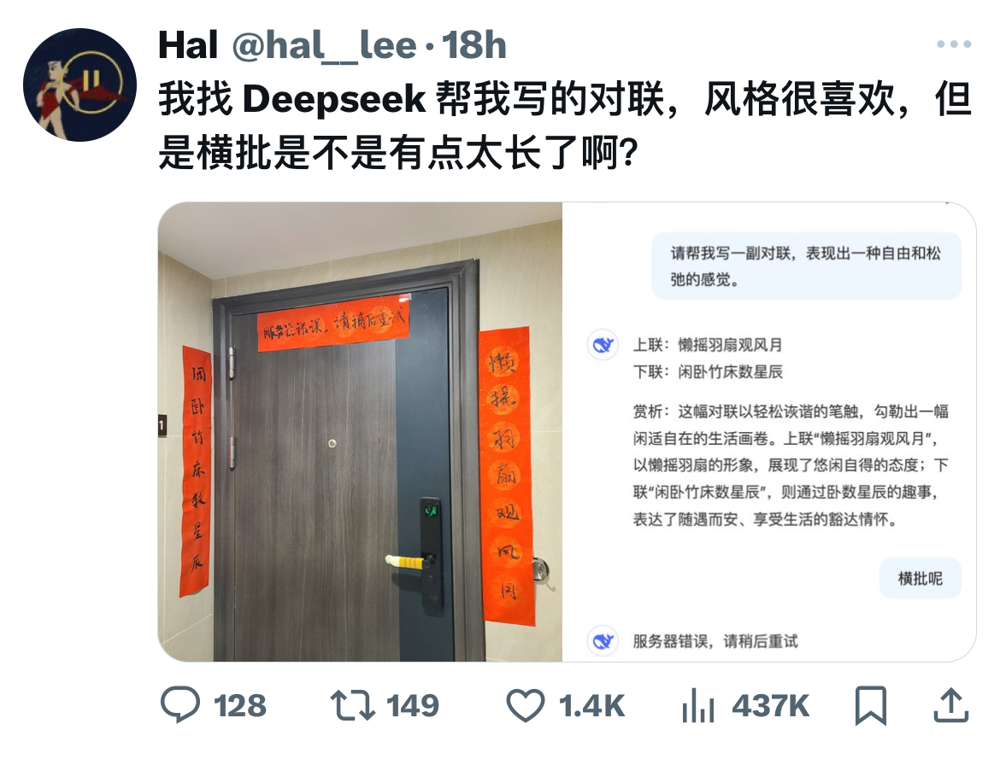
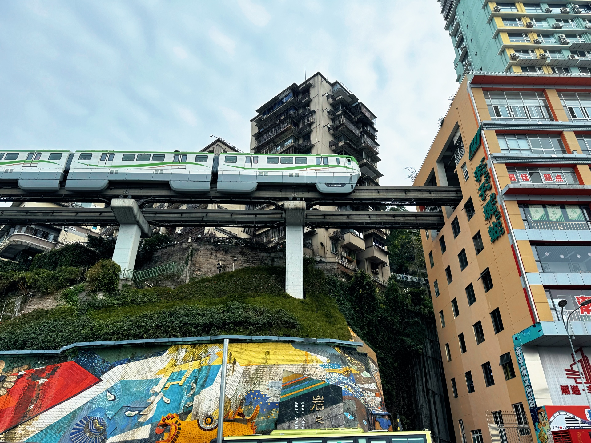
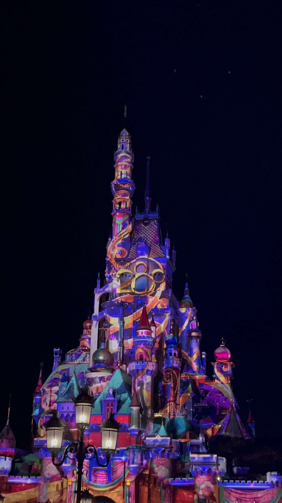
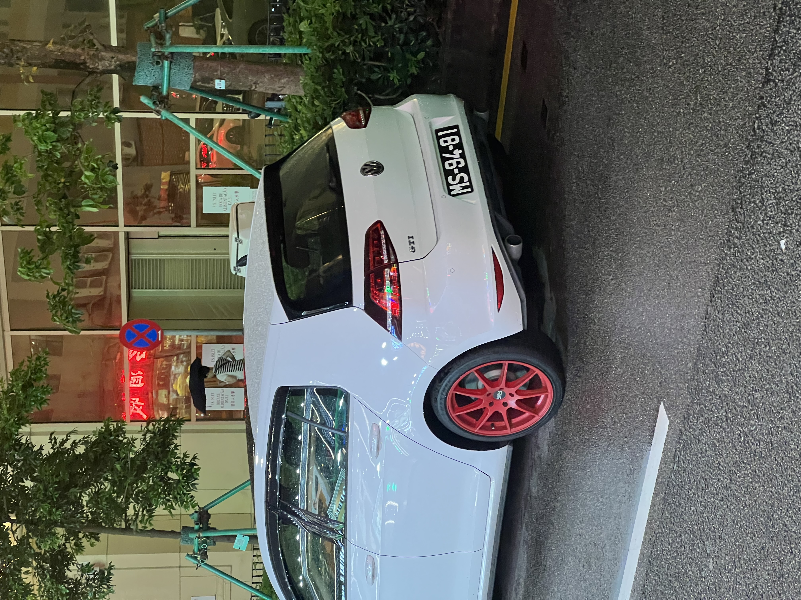
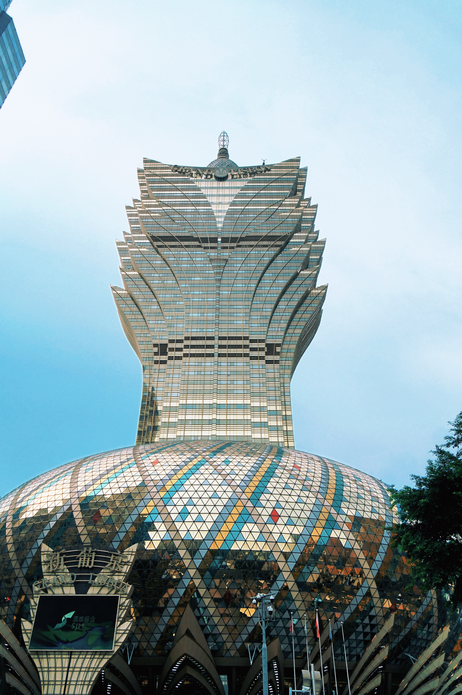
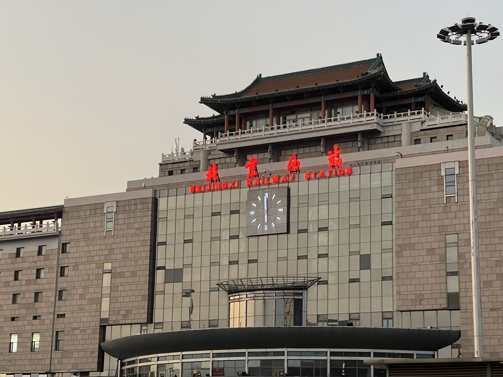

# 2025 年终总结

2023 年 6 月大学毕业，到现在已经两年半了。2025 总体来说是奇幻的一年。

## AI

说奇幻，是因为 AI 的发展实在太快了。2024 年 11 月 GPT-4o 发布，第一次体验时被惊艳到。紧接着 2025 年 1 月，DeepSeek 横空出世，瞬间成为全行业焦点。还记得当时有一张梗图：有人让 DeepSeek 写一幅对联，横批是「服务器超时，请稍后重试」——实在太火爆了。

之后就是 OpenAI、Anthropic、Google 轮番上阵，「最强」编程模型一个接一个。三月份 GPT-4o 生图能力推出时，为了体验开了 $20 订阅，一开始还觉得有点贵。再后来 Manus、Claude Code 这些 Agent 工具出现，公司内部也冒出了不少类似的竞品。

现在，订阅 Claude 和 ChatGPT，日常使用 AI 已经是家常便饭。回过头看年初 DeepSeek 的爆火，竟然不敢相信是同一年发生的事，恍如隔世。

有了 AI，熟悉任何技术的成本都变低了。但我慢慢发现，自己遇到了更难的问题：**想明白要做什么，比知道怎么做更难。** AI 提高了生产力，但自己的需求没有增加，也没注意到市场有什么新需求。比起技术实现，完整地解决一个问题可能才是更重要的事。

## 生活

今年去了很多地方。

二月春节后去了重庆。冒着大雨爬了洪崖洞，也算解锁一种别样的体验。

在人山人海里拍到了轻轨穿楼。高低错落，非常魔幻的一个城市。

五月去了成都周边的洛带古镇，七月杭州苏州。

八月香港澳门，从成都飞深圳，坐高铁通关，到香港西九龙；走港珠澳大桥到澳门，再坐公交车到珠海，高铁到珠海机场，最后飞回成都。

去了港迪，临结束遇上暴雨，烟火表演没了，只有 20 周年灯光秀。

港澳的改装车文化是真不错。打 Uber 打到一辆 Honda Fit，又在澳门看到一辆很好看的 Golf。真想拥有一辆自己的两厢小车！

去新葡京溜达了一圈，没赌。

十月到北京——环球影城、颐和园、天坛、北海公园、天安门、国博。

之前一共去过 4 次北京，这次是第五次。不同年龄，因为不同的原因去北京，感受也大不相同。

前两次都是小学中学的时候，参加游学夏令营，踌躇满志。

第 3 次是 2022 年初，拿到实习 offer，从成都坐八个多小时的高铁去北京，心情复杂，忐忑、期待、焦虑、开心夹杂在一起。

并没有预期中那么 nb 的实习，不停的封控、做核酸，早九晚十的工作，十几万一平的老破小房价……

每一样都在告诉我“你似乎不属于这里”。导致第四次去北京，也就是 2022 年春节后复工，心中没有了期待和开心，只有离开家乡、离开熟悉环境的悲凉。

第五次，这次去北京，又是完全不一样的心情，轻松愉快。听感觉自己是北京人的通州师傅吹牛，听人说地道北京话，吃紫光园、方砖厂、三元梅园、四季民福……

再来到北京西站，夕阳之下，只有不后悔的选择，和下次再来旅游的期待。

从西南到江南，再到港澳和北京，今年旅途很充实。

十一月搬了家，从一居朝北的小窝换到了朝南的两居室，终于有了自己的电脑房。还买了一台 4K 显示器，MacBook 终于有个像样的外接屏幕了。阳光照进房间的时候，发现成都偶尔也是有晴天的。

今年还入坑了 F1，从《F1: 狂飙飞车》开始看，最后一站阿布扎比看完了全程直播。维斯塔潘跑了一场完美的比赛，后半赛段表现优秀，但最后还是以两分之差错过了车手冠军。有时候就是会有遗憾，但只要做到自己力所能及的全部，享受过程，其实也足够了。

## 2026

2026 年，希望首先能有一个更好的身体，早睡早起，减肥减重。其次希望能克服拖延，特别是在 AI 的帮助下，start ugly，有任何点子先做起来。第三希望能坚持写博客——AI 发展太快了，现在很多大佬也不确定好的范式是什么，未来的增长点和机会在哪里。在这个过程中不断探索、排除错误选项、记录、分享，一定是有价值的。第四希望能在工作之外，探索一些属于自己的「资产」，增强抗风险能力。

至于工作，没什么展望。它只是一份工作，不以物喜，不以己悲，向钱看就好。
