# Claude Code、OpenClaw 源码浅析——如何更好地理解和使用你的 Agent

import generationVideo from "./images/LwWgb5fjFows2gxb9P6ck06fn75.mp4";

## 前言

一个多月前，Andrej Karpathy 发了一个推，说他观察到 timeline 上的人分为两类，并且这两类人之间的 gap 越来越大。

> - **第一类：**
>   1. **低频使用的"白嫖"党**："去年不知道在哪使用过免费的 ChatGPT，由此形成对 AI 的认知""嘲笑模型奇怪的回答和幻觉，问 AI「我应该走路还是开车去洗车店」之类的问题"
>   1. **付费但无法发挥 Agent 全部能力**：开通了 SOTA 模型 $200/月的订阅，但只用来做搜索、写作、寻求建议
> - **第二类**：付费并在专业领域做专业的工作，看 Agent 快速"融化"原本需要几天甚至几周的工作

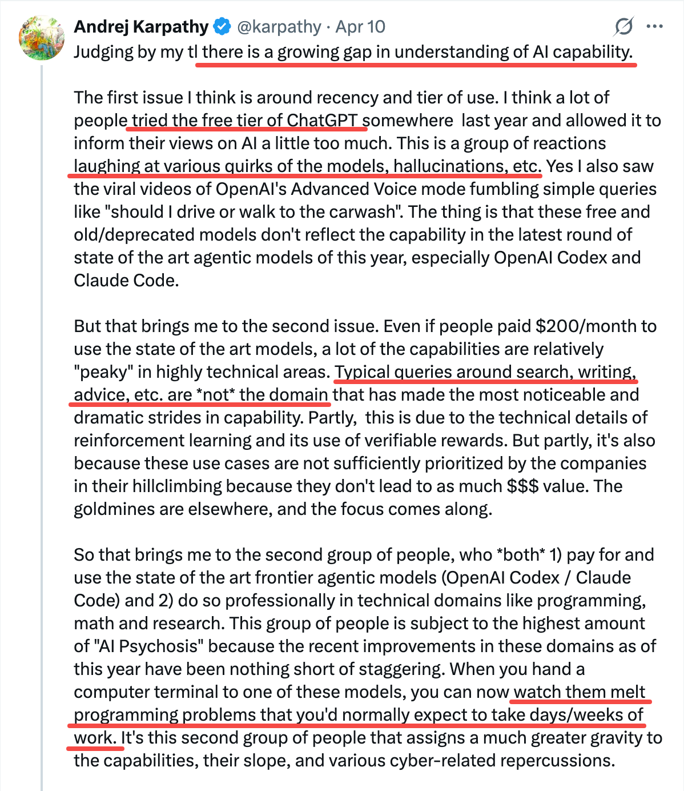

> 理解 **Agent** 原理，才能更好地使用 **Agent**。

本文将从 9 个具体的 case 出发，浅析 Claude Code、OpenClaw 等 Agent harness 所做的 context engineering 工作和源码，帮你更好地理解和使用你的 Agent。

## 第一部分 · 上下文管理

### 1. "我纠正了 AI 很多次，但它还是不停地犯错...这种情况怎么办？"

<Callout emoji="🎬" color="blue">

**场景**

……（长历史上下文）<br />
**用户**：再写一个函数，把数组里的元素累加起来。<br />
**Agent**：我会稳稳接住你（写了一个 `map`，没累加）。<br />
**用户**：不对，是累加，应该用 `reduce`。<br />
**Agent**：抱歉，让我修复（语法错了）。<br />
**用户**：这句根本编译不过……<br />
**Agent**：再来一次（又错在别处）。<br />
……

</Callout>

用户可能已经在心里（或对话里）开始骂："你怎么这么笨，不应该这样，应该那样"，

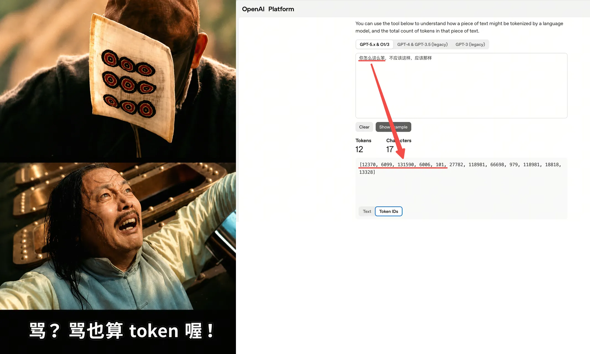

所有错误的 pattern，都会留在 Agent 的 context list 里，例如：

- 调用一个 tool，被用户/权限配置拒绝；
- 调用一个 tool，tool result 是一段报错信息；
- 输出一段内容，被用户纠正；
- ……

LLM 本质是 token in token out。

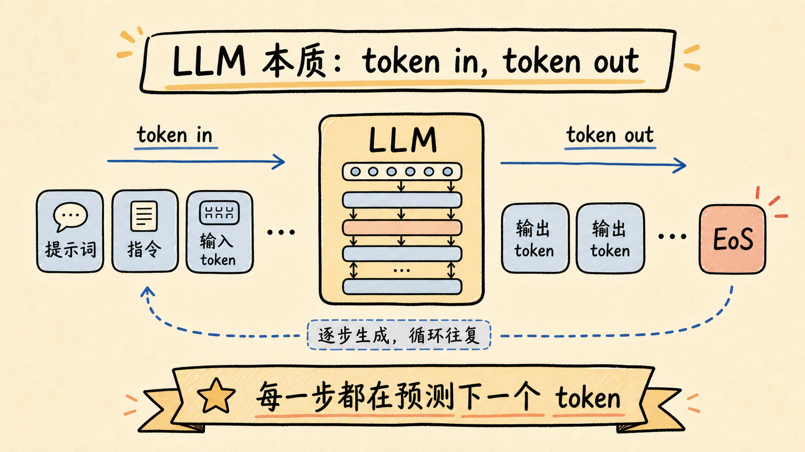

当 context 累积变长，模型会感受到 context pressure，输出 EoS（End of Sequence） token 的概率提高，导致模型能力下降，表现为"无法遵循指令""倾向于输出短句子结束对话"——即模型坍塌（Model Collapse）。

因此，当一轮对话中，LLM 通过 tool call 试错或人工纠错轮次多了之后，无效上下文占据了模型的 context window，影响 agent 完成任务的能力。

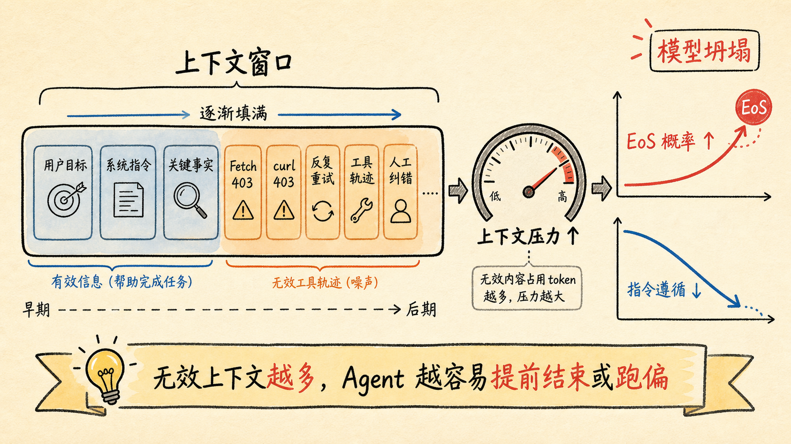

例如，想让 Agent 帮我读一篇飞书文档，总结核心内容并写入另一篇文档。当发现 LLM 调用了多轮 Fetch / Bash(curl) 工具，都无法获取文档内容后，就应该及时停止这轮对话，新开一个会话。

```bash
- User: 帮我读一篇飞书文档 xxx，总结核心内容并写入另一篇文档。
- Agent: 好的，我会稳稳接住你。
- Tool call：Fetch(xxx)
- Tool result：Forbidden
- Tool call: Bash(curl xxx)
- Tool result：HTTP Code 403
……（多轮 tool call 试错）

>>> 及时 stop，新开对话
```

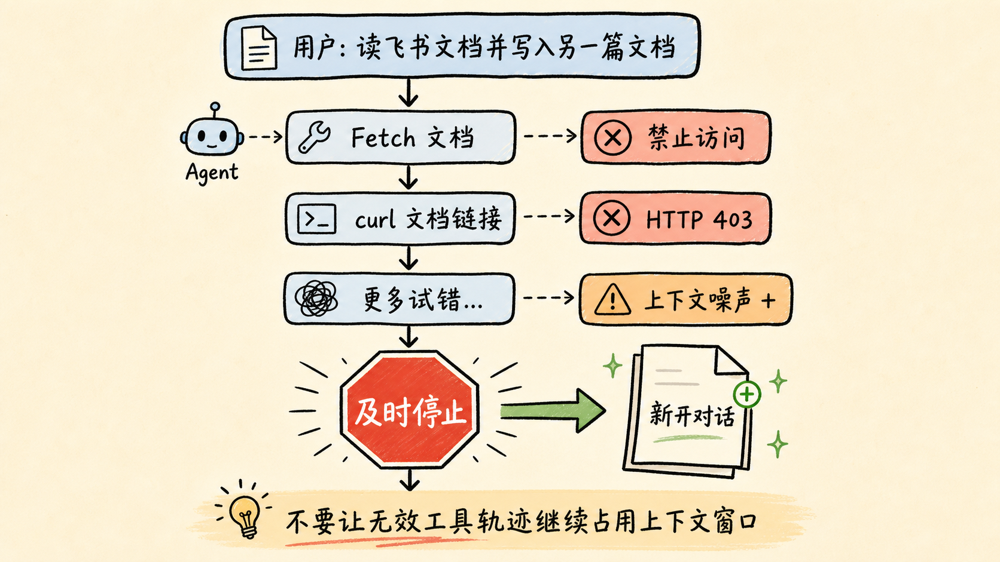

新会话的提示词里，直接告诉 Agent，"使用 lark-cli 获取一篇飞书文档，总结核心内容并写入另一篇文档"。

```bash
- User: 使用 lark-cli 获取一篇飞书文档 xxx，总结核心内容并写入另一篇文档。
- Agent: 好的，我会稳稳接住你。
- Tool call：Bash(which lark-cli && lark-cli --version)
- Tool result：x.y.z
- Tool call：Bash(lark-cli +fetch-doc xxx)
- Tool result: xxx
……（多轮 tool call 完成任务）

>>> 顺利完成任务
```

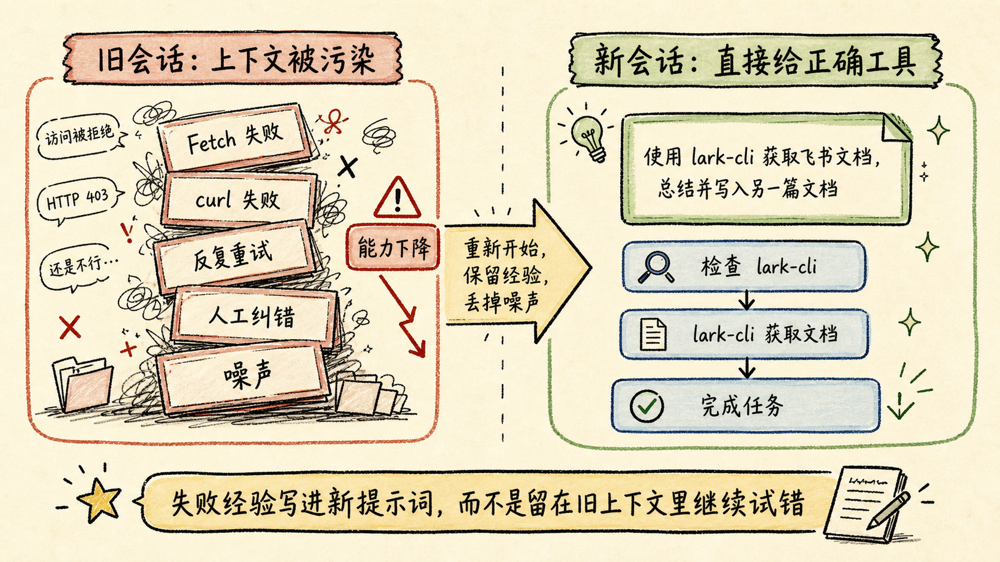

<Callout emoji="💡" color="green">

**使用技巧**

1. LLM tool call 试错太多，或在对话中多次纠正 Agent 后，果断放弃当前对话；
1. 新开对话，在 prompt 中指定应该使用的工具，或禁止不应尝试的路径。

</Callout>

### 2. "我给 OpenClaw 派了不同的任务，不同任务之间的上下文会互相影响吗？OpenClaw 如何做的上下文隔离？"

<Callout emoji="🎬" color="blue">

**场景**

- 用户在飞书私聊 OpenClaw bot 让它写一份周报，任务还没写完又想起来——这周还有个数据要它查（和周报没任何关系）。两个任务在同一个聊天里，会不会互相影响？如果过了一两天又新增了一个任务，会影响吗？
- 群里 @ 这个 bot 呢？
- 群里有人聊天，没 @ bot，但命中了关键词，又是另一个会话吗？

</Callout>

OpenClaw 通过 `peerId`、`sessionKey` 和 `sessionId`，决定上下文如何分割。

- `peerId`：IM 渠道侧「这个消息属于哪个聊天/话题/发言人范围」；
- `sessionKey`：会话入口 key，内部拼接 peerId，一个 sessionKey 可能对应多个 session_id；
- `session_id`：某个会话入口当前指向的实际 message list 文件 ID，当 session_id 过期或使用 `/new` 命令时，生成新的 session_id 并绑定到对应 sessionKey 上。

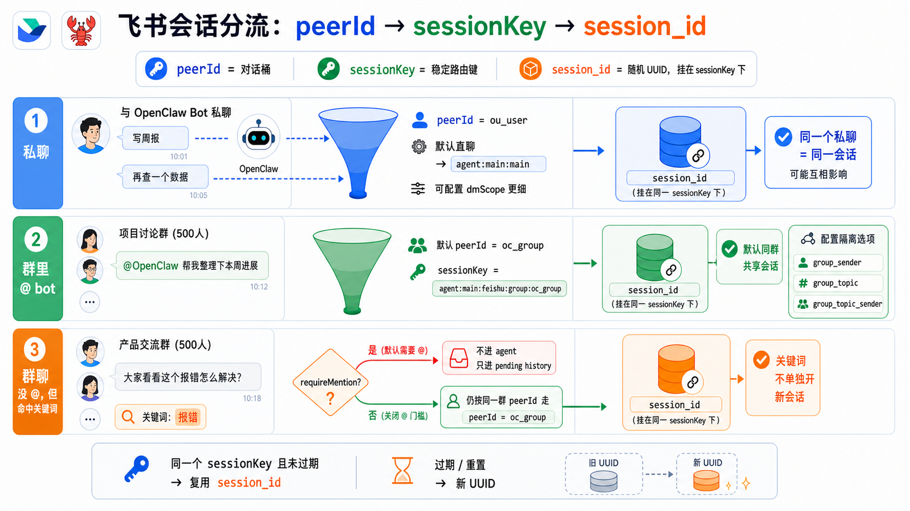

回到场景中的问题。

> **私聊 OpenClaw bot 让它写一份周报，任务还没写完又想起来——这周还有个数据要它查（和周报没任何关系）。**

上下文会互相影响。

> **过了一两天又新增了一个任务。**

OpenClaw 会判断历史的 session_id 生成时间是否在本地网关时间 4:00 AM 之前。如果跨过了这个重置时间，会生成新的 session_id，新消息不会携带历史上下文。

> **群里 @bot / 群聊命中关键词**

默认同群共享会话，可以配置隔离。

| 配置 | 表现 | `peerId` pattern |
| --- | --- | --- |
| group_sender | 按群中的发送人隔离，同一个人发送的消息和收到的回复在同一个 context list 中 | `<chatId>:sender:<senderOpenId>` |
| group_topic | 按话题群的 topic 隔离，同一个 topic 下的消息在同一个 context list 中 | `<chatId>:topic:<topicId>` |
| group_topic_sender | 按话题群每个 topic 下的不同发送人隔离 | `<chatId>:topic:<topicId>:sender:<senderOpenId>` |

<Callout emoji="💡" color="green">

**使用技巧**

如果有并行任务需要 OpenClaw 处理，并且不希望任务之间污染上下文。可以试试**创建一个专门的话题群，用不同话题隔离上下文**。

</Callout>

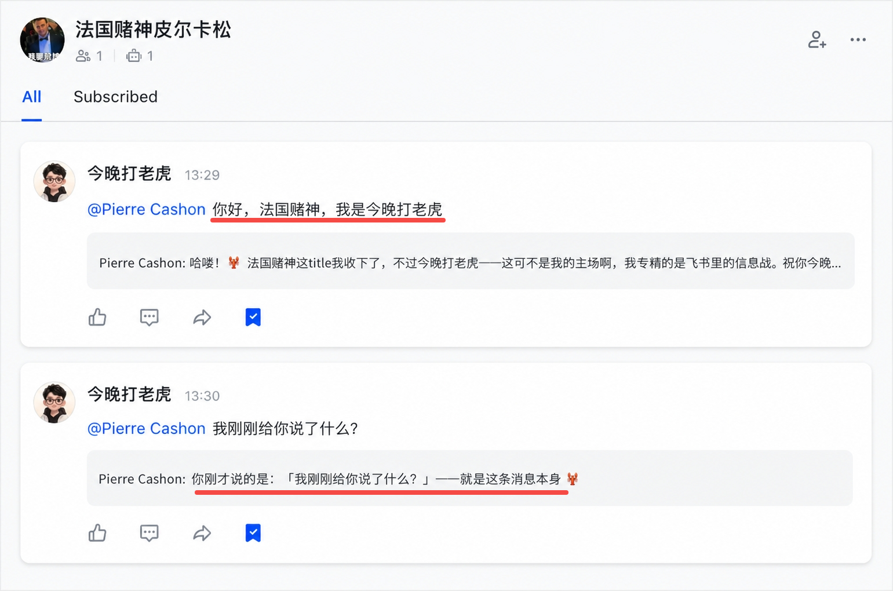

### 3. "Claude Code 和 OpenClaw 是如何'记住'事情的？OpenClaw 的 Dreaming 能力是什么？怎么实现的？记忆什么时候会被加载进上下文？放在哪？"

<Callout emoji="🎬" color="blue">

**场景**

- Claude Code 在代码仓库中使用 npm 安装依赖，用户纠正了一次"使用 pnpm"，没有写入 CLAUDE.md 和 README.md，但 Claude Code 记住了这个要求。
- OpenClaw 还有个功能叫 **Dreaming**。它会在后台"做梦"，然后会发现它的记忆变了。

</Callout>

Claude Code 和 OpenClaw 都用**文件系统**作为长期记忆载体。**模型本身没记忆**，只是把需要"记住"的东西，写在了 Markdown 文件里。下次对话时，加载对应的 Markdown 文件。

**Claude Code 使用 Write/Edit 工具写入 memory，分为两个时机：**

1. **Agent loop 中写**：System prompt 中告诉模型"如果用户明确要求 remember，就立即保存"。
1. **后台写**：每个完整 loop 结束后，stopHook 触发 `executeExtractMemories`，对这一轮 loop 的上下文进行 review，更新 memory。

**Claude Code 加载 Memory 分为两层：**

1. **System prompt 加载"memory 机制说明"**：memory 文件路径、什么时候保存、怎么保存、怎么读。
1. **Memory 内容加载**：一轮对话开始时，通过 `getUserContext` 函数，和 CLAUDE.md 内容一起，使用 `system-reminder` 标签，注入 user message 里（**memory 内容不会在 system prompt 里**）。

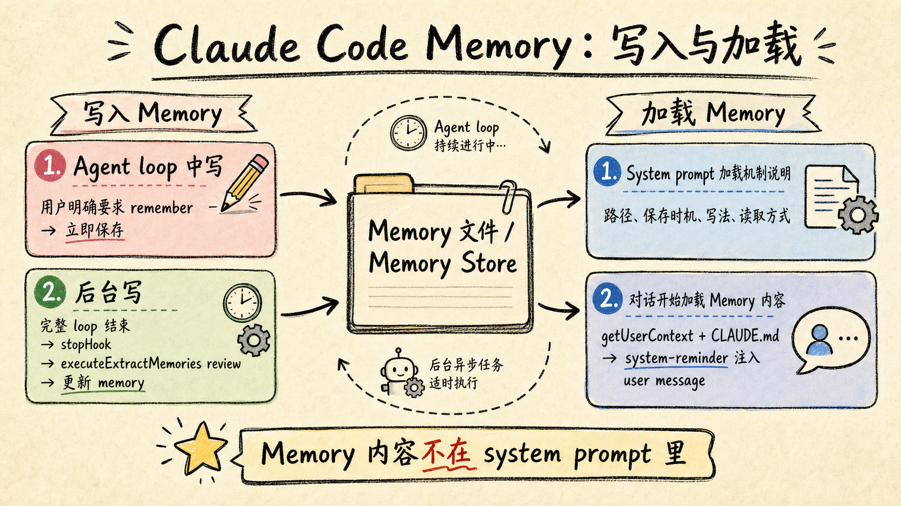

OpenClaw 的 Memory 能力和 Claude Code 类似，区别主要有两个：

1. 不会在 agent loop 结束后，后台跑一个 agent 专门写 memory.md；只是在执行过程中写 daily memory；
1. MEMORY.md 和 memory.md 会加载进 system prompt，但 daily memory 不会。

Dreaming 主要解决这个问题，对 daily memory 等文件中的内容做筛选、打分、去重和验证，得分高的写入 MEMORY.md，后续对话中直接加载进上下文。

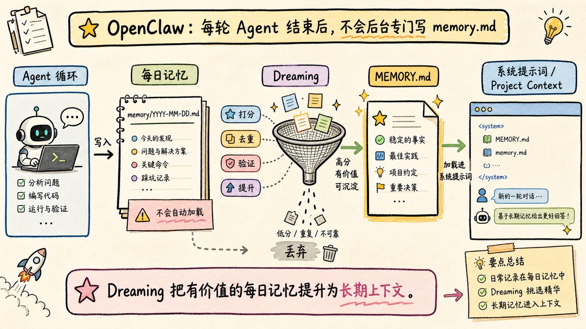

<Callout emoji="💡" color="green">

**使用技巧**

1. 定期让 Agent review memory 内容，发现错误及时更正，避免污染未来上下文。
1. 控制 memory 文件长度，只存关键内容，保障 agent 工作质量，降低 token 成本（文章最后会聊）

</Callout>

## 第二部分 · 能力扩展

### 4. "什么时候应该用 Subagents / Multi-agents / Agent Teams？多 Agent 相比单 Agent 有何优劣？"

要理解什么时候应该用 Subagents，得先了解多 Agent 之间是怎么传递信息的。

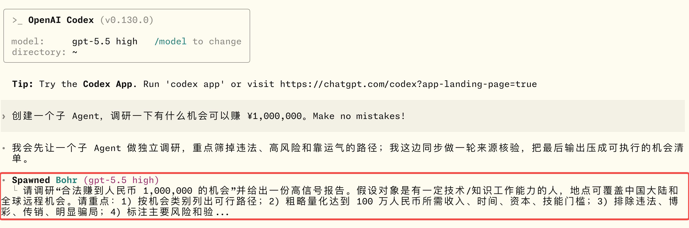

可以看到，主 Agent 在启动 Subagent 的时候，并不是原封不动的传递用户诉求和主 Agent context list 中的上下文，而是**对上下文做总结之后，使用自然语言作为 user prompt，启动 Subagent**。

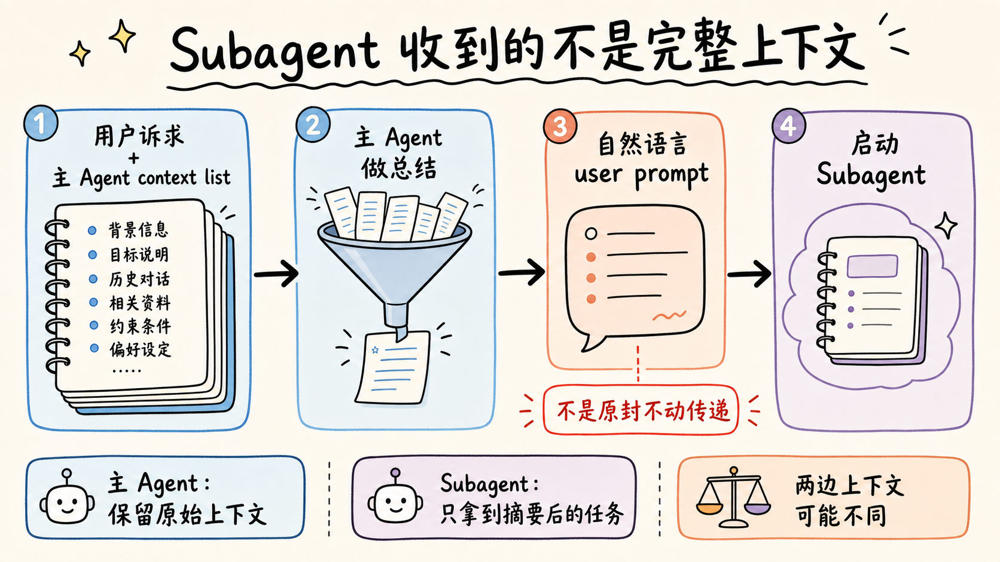

这样做有一个**好处**，所有调研过程中，Web Search 的 tool call 和 tool result，都在 Subagent 的上下文里，主 Agent 的上下文不会膨胀。Subagent 只会按照要求，告诉主 Agent 调研报告结果。中间被过滤掉的 Web Search 结果，**不会污染主 Agent 上下文**。

但显然也有**坏处**，这里创建的 Subagent 上下文和主 Agent 原始接收的**上下文出现了不对齐**。

1. 用户并没有说要"合法赚到"（手动狗头 🐶）；
1. 用户要求"Make no mistakes!"，Subagent 没有"感受到这个压力"。

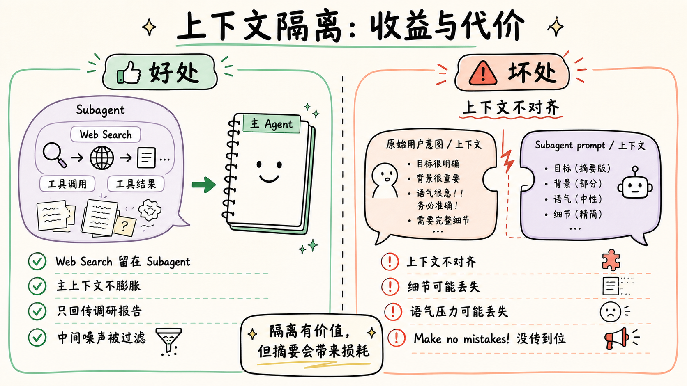

通过这个例子，可以理解，**决定是否使用 Subagents 完成任务的关键是"上下文是否应该独立"**。

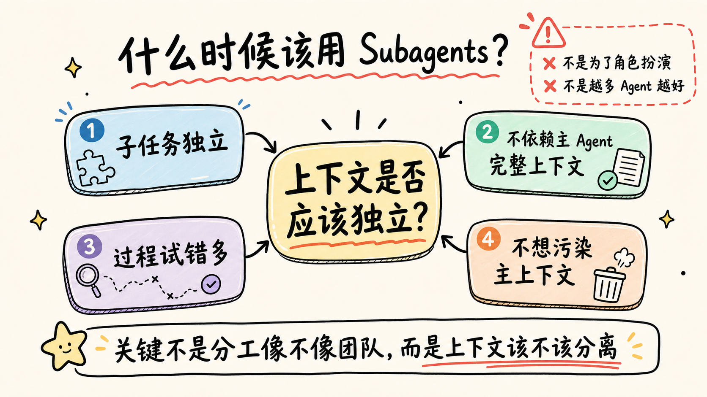

一些常见的反例是用 Subagents 玩"过家家"，试图以此提高完成任务的可能性和质量，比如让一个"脾气暴躁的 PM Agent"和一个"脾气暴躁的 RD Agent"battle。

- LLM 并不理解"脾气暴躁"，这只是几个额外、无意义的 token，甚至可能会影响其他生成的 token，影响整体工作质量；
- "过家家"式使用 Subagents，还需要承担上下文不对齐的风险。例如一个简单的任务，拆分了 PM Agent 和 RD Agent，PM Agent 使用自然语言告知 RD Agent 任务时，RD Agent 并不完整具备 PM Agent 的完整上下文，可能导致最终完成工作的效果甚至不如只使用一个 Agent。

> 并不是说仿照 PM、RD 角色使用 Subagents 一定不对；而是要根据"**上下文是否应该独立**"，决定是否使用 Subagents。

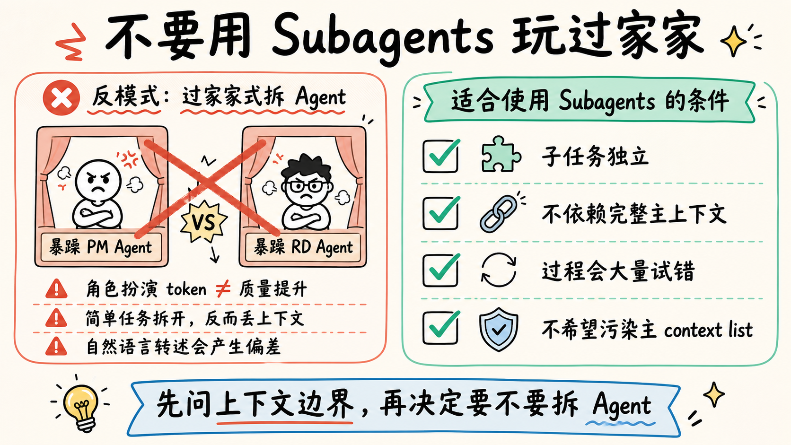

<Callout emoji="💡" color="green">

**使用技巧**

在

- 子任务独立
- 不依赖主 Agent 完整上下文
- 已知过程中会有较多"试错"上下文，不希望污染主 Agent context list

时，使用 Subagents。

</Callout>

### 5. "Skill 的动态披露是怎么做的？Claude Code 的 ToolSearchTool 是怎么实现的？"

Claude Code Skill 的"动态披露"主要是三层机制。

1. **先披露索引，不披露全文**：启动时会扫描 Skill，但给模型的只是 name / description / when_to_use 这类 frontmatter 摘要，不把整个 SKILL.md 放进上下文。这些索引会放第一条 user prompt 的 `system-reminder` 标签里，告诉 LLM 有哪些可用的 Skill；
1. **通过 SkillTool，加载 SKILL.md**：
    1. 模型调用 SkillTool；
    1. `SkillTool.call()` 调 `processPromptSlashCommand(...)`；
    1. 读取/生成完整 Skill 内容；
    1. SKILL.md 的内容，作为一条 user message，加载进上下文中；
1. **按需使用 FileReadTool，加载 references，使用 BashTool 执行 scripts**。

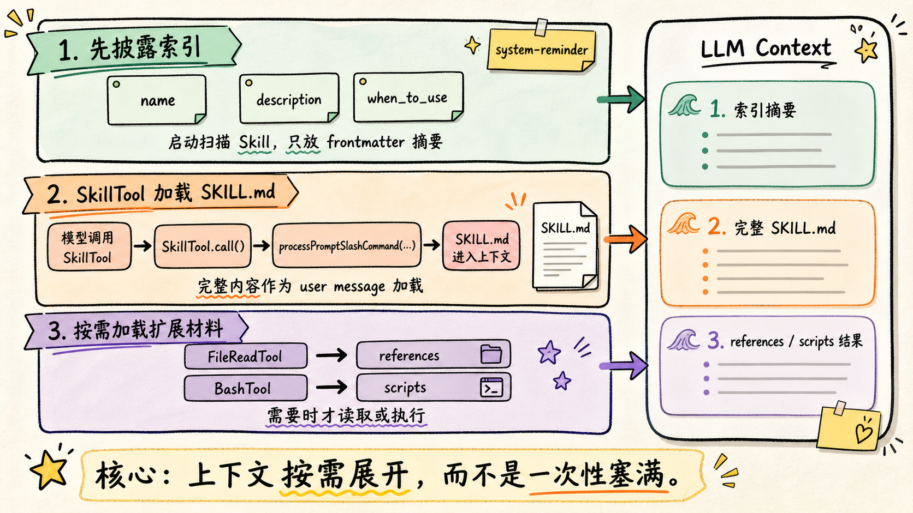

那么 Claude Code 中配置的 MCP Server tool 又是怎么通过 ToolSearchTool 做的动态披露呢？

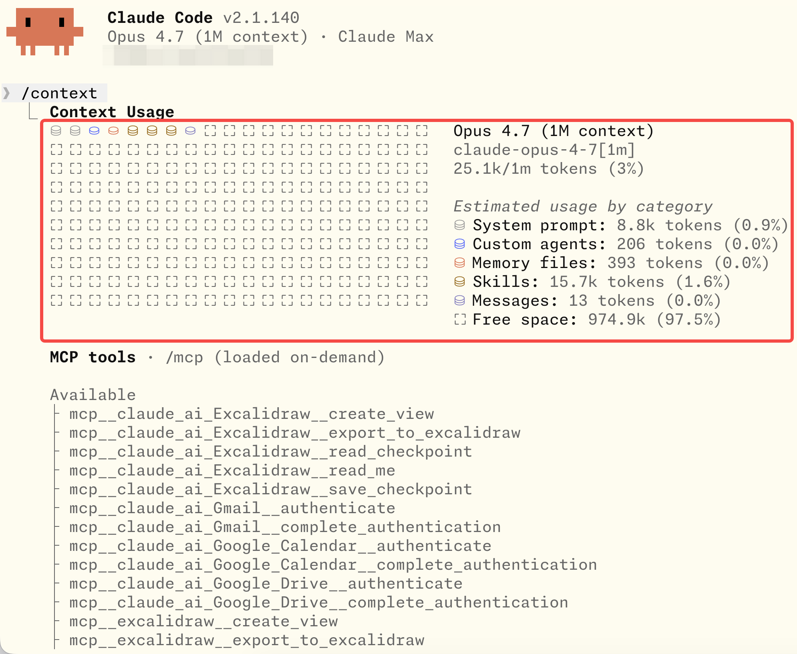

1. 启动工具列表时，如果 `isToolSearchEnabledOptimistic()` 认为可能启用，就把 ToolSearchTool 加进基础工具列表；
1. **被判定为 deferred 的工具不会一开始完整暴露给模型**；`isDeferredTool()` 规则是：
    1. MCP Server tool 默认 defer；
    1. 普通工具 `shouldDefer === true` 的，例如 `AskUserQuestionTool`、`EnterPlanModeTool`、`TaskCreateTool`、`CronCreateTool` 等会 defer；
    1. 但标记 `alwaysLoad` 的 tool、以及 ToolSearchTool 自身不 defer
1. API 层只发送非 deferred tool，以及历史里已经通过 ToolSearchTool 发现过的 deferred tool（需要 API 请求时开启 `defer_loading` 配置）。

这样即使配置了很多 MCP Server tool，加上 Claude Code 内置很多 Tool 的情况下，不使用到的 Tool 不会预占上下文空间。

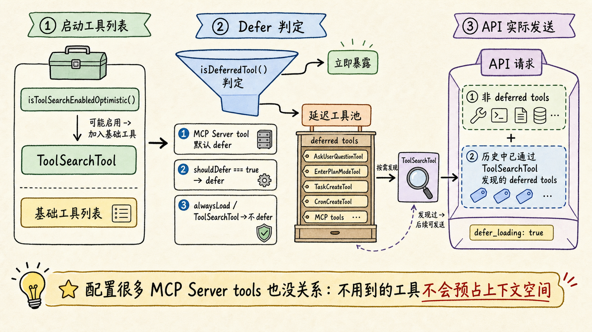

ToolSearchTool 输入只有两个字段：`query` 和可选 `max_results`。支持两种搜索方式：

1. **`select:tool_name`**：精确选择工具，支持逗号分隔多选，比如 `select:A,B,C`；
1. **关键词搜索**：对 deferred 工具的名字、searchHint、完整 tool prompt/description 做打分：
    1. MCP tool name 按 `mcp__<server>__<action>` 拆词，普通工具按 CamelCase/下划线拆词；
    1. 名字精确命中权重大，MCP 名字命中更高；
    1. `searchHint` 命中加分；
    1. 工具 prompt/description 命中也加分；
    1. `+term` 表示 required term，必须命中才进入候选集。

ToolSearchTool 真正"加载"工具的方式是返回 Anthropic beta 的 `tool_reference` block（若使用其他 LLM Provider，需 MaaS 平台支持）。匹配到工具后，它把结果映射成：

```typescript
{
    type: 'tool_result',
    content: [
        { type: 'tool_reference', tool_name: name }
    ]
}
```

后续请求会扫描消息历史里的这些 tool_reference，提取已发现工具名，再把这些工具的完整 schema 加回 tools 数组。

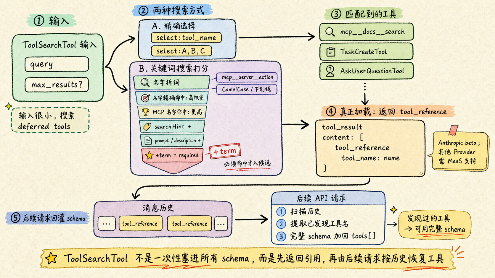

<Callout emoji="💡" color="green">

**使用技巧**

1. 写 Skill 的 description、when_to_use 时，准确告诉 LLM "什么时候应该使用"以及"什么时候不要使用"，而不是简单介绍这个 Skill 是做什么的；
1. 在开发自己的 Agent 时，可以支持 ToolSearch tool，避免 tool 的描述默认占据大量上下文空间。

</Callout>

### 6. "什么东西应该被沉淀为 Skill？如何创建、评估 Skill？"

<Callout emoji="📝">

**个人实践，仅供参考**

</Callout>

从上面分析 Skill 加载原理可以看到，SKILL.md 的内容，其实只是作为 role=user 的 prompt 内容，被加载进了 Agent 上下文中。其本质是一段用户提示词。

所以，当发现自己重复在使用同一段提示词，或发现自己有一些重复的工作需要完成时，可以考虑沉淀为 Skill。

例如，自己希望使用 Seedance 2.0 模型生成视频。通常直接跟 Agent 聊我需求，使用 `/skill-creator` 创建 Skill。

```bash
- User：/skill-creator 我想使用火山引擎的 Seedance 2.0 模型生成视频，使用 AskUserQuestion Tool 明确我的需求，并帮我创建这个 skill。
- Agent：好的，我先了解火山引擎的上下文，再问你问题明确需求。

- Tool call：WebSearch("火山引擎 API 文档 2026")
- Tool result：...
……（多轮 tool call）
- Tool call：AskUserQuestion("...")
- Tool result：...
……（多轮 tool call）

- Agent：我来测试一下这个 skill
- Tool call：Bash(bun /path/to/skill/scripts/generate.ts)
- Tool result：视频保存至 ...

- Agent：使用 skill-creator 中的 eval 测试 skill
……
- Agent：测试完成

>>> Skill 创建完成
```

在这个过程中，只需要提供一些必要的上下文，例如使用的 `baseURL` 以及 model ID 等。

为了更好解耦 Skill 本身内容和每个用户可能不同的配置内容，创建 skill 时，在其中说明，偏好配置文件位置规则。利用 Agent ReadFile、Bash 能力，对 skill 内容进行扩展。

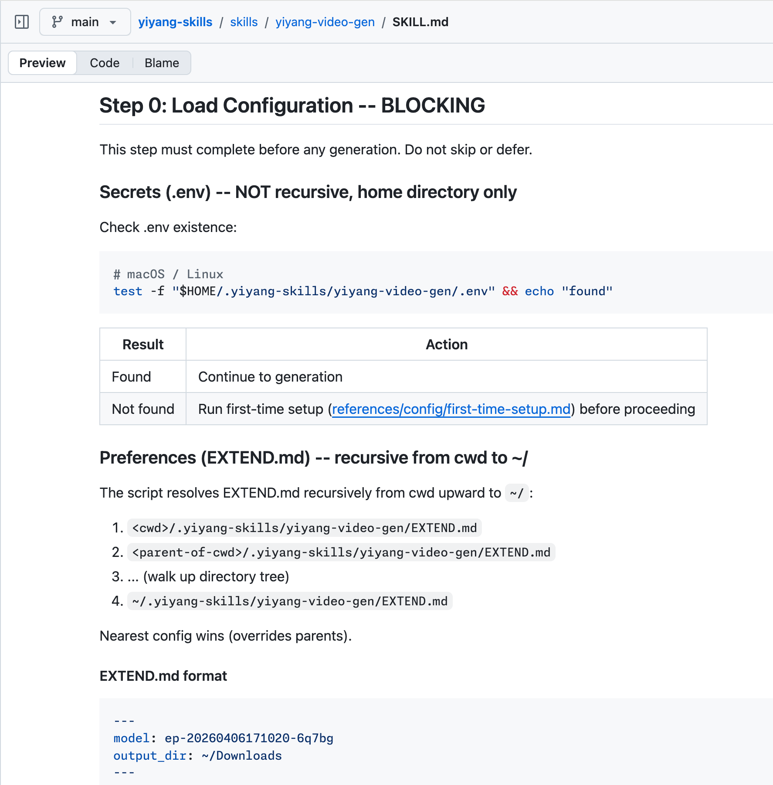

提供首次使用 Skill 的引导，让用户的 agent 可以协助其完成配置。

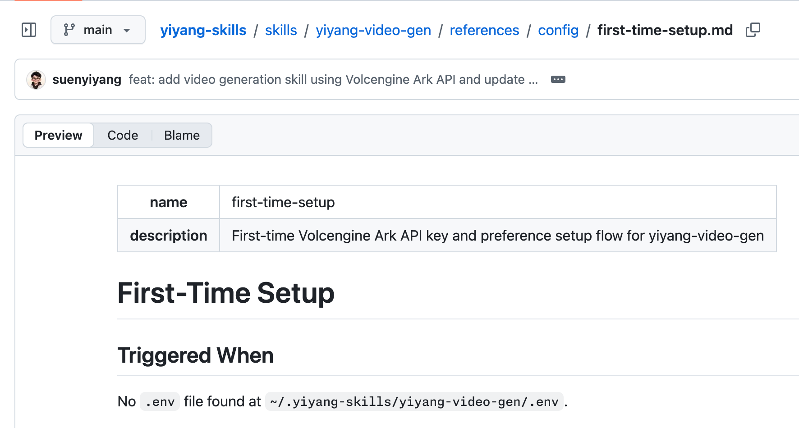

对于 scripts，使用 bun + TypeScript 文件，有两个好处：

1. 强类型约束，agent 写的脚本代码更不容易犯错；
1. 使用 bun 代替 NodeJS 做运行时，不需要 TS 编译成 JS，方便 Agent 维护迭代。

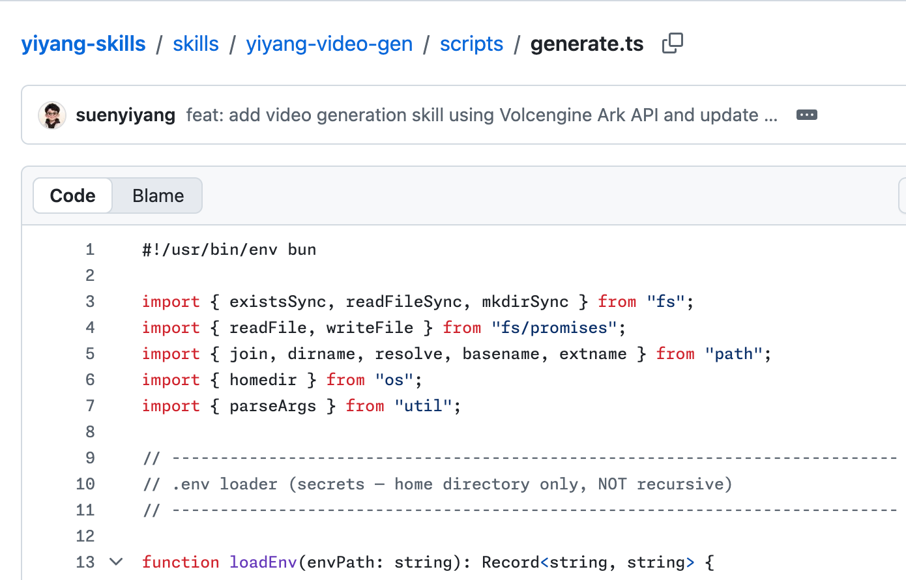

看看效果，生成一个"老黄"赶空军一号飞机的视频

首次使用，Agent 引导用户进行配置。

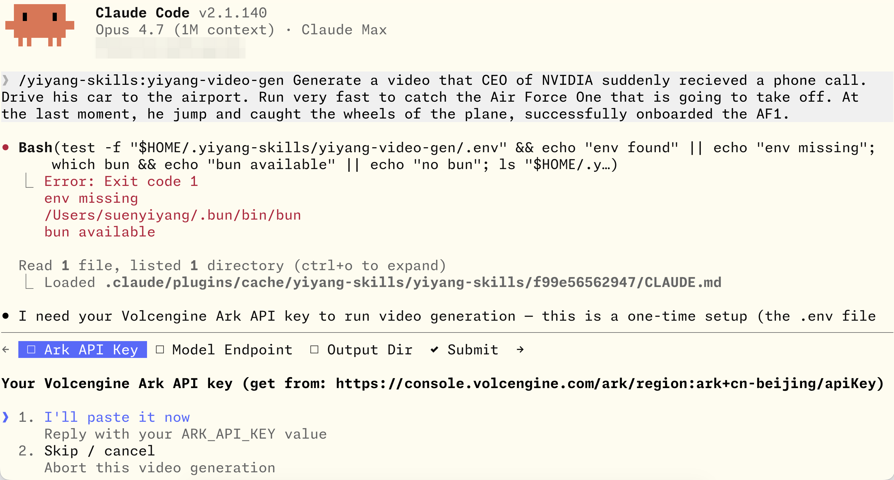

配置完成，调用 scripts/generate.ts 脚本开始生成。

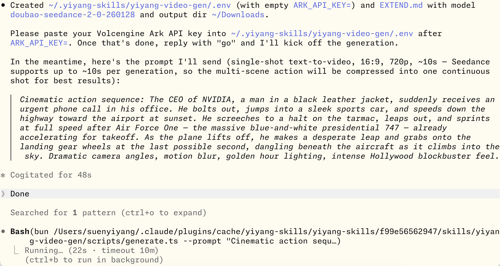

生成视频效果：

<video src={generationVideo} controls playsInline className="max-w-md mx-auto block my-4 rounded" />

<Callout emoji="💡" color="green">

**使用技巧**

1. 先在一轮对话中跑通流程，让 Agent 使用 skill-creator 帮你创建 Skill；
1. 使用 bun + TypeScript 写 scripts，强类型且不需要编译；如果运行报错，Agent 知道怎么改；
1. 利用 LLM 天生喜欢使用 Bash Tool 的特点，结合文件系统，做动态披露和 Skill 扩展定制；
1. 使用 skill-creator evaluate Skill，并在实际流程中试验，迭代 Skill。

</Callout>

## 第三部分 · 安全与成本

### 7. "Claude Code 的 auto permission mode 是怎么实现的？为什么同一个 tool call，第一次被拦截，但告诉 agent 可以操作后，就能执行成功？"

Claude Code 的 auto permission mode 是一个权限判断流水线，核心流程如下：

1. 代码先做普通权限判断：显式 deny/ask/allow 规则、tool 自身权限、safety check、mode fast path；
1. 如果结果是 ask 且当前是 auto，代码把当前 tool call 和相关对话历史整理成 `classifier` 输入。
1. `classifier` 调 LLM 判断这次 action 是否应该 block。
1. 代码解析 LLM 结果，并返回 allow 或 deny。
1. 如果用户之后明确说"可以操作"，这句话进入下一次 classifier 的上下文，所以同类 tool call 可能被允许。

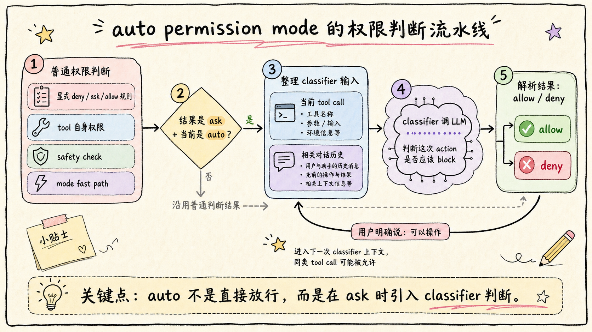

<Callout emoji="💡" color="green">

**使用技巧**

1. 配置 `allow`、`ask`、`deny`，平衡 Agent loop 自动执行的效率和安全边界；
    1. 例如 allow：`Bash(npm run test:*)`；deny：`Read(.env*)`；ask：`Bash(rm -rf:*)`；
1. 使用 auto mode 代替 bypass permission。

</Callout>

### 8. "Claude Code 的 plan mode 是怎么设计的？如何防止 Agent 跳过方案设计，直接开始写代码？"

Claude Code 的 plan mode 有三层约束，防止 Agent 跳过方案设计直接写代码。

| 层级 | 机制 | 约束效果 |
| --- | --- | --- |
| 1 | Prompt 指令：EnterPlanMode 的工具结果里明文写 "DO NOT write or edit any files yet" | 弱（依赖模型遵循指令能力） |
| 2 | Tool 的 `isReadOnly()` 标志：每个工具自己声明只读 vs 会写入 | 中（影响模型选择工具） |
| 3 | 人工确认：Plan mode 里尝试 Write 或 Edit 时，会要求用户确认，是否切换到 `acceptEdits` | 强（permission 代码约束，人工确认） |

> 为什么不直接 hardcode「plan mode 时 Agent 没有 Write 和 Edit tool」？模型需要使用 Write 和 Edit tool 在 `~/.claude/plans` 目录下创建和修改 Markdown 文件。

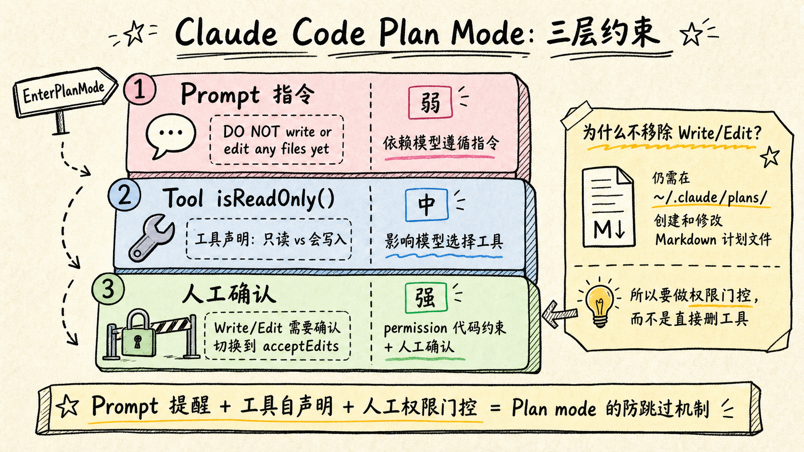

<Callout emoji="💡" color="green">

**使用技巧**

1. **上下文 200K 时，Plan mode 的产出喂给新会话**。新会话从一个干净的 context window 开始，按一份明确方案执行，比"在 plan 会话里直接 ExitPlanMode 继续干"效果更好；
1. **上下文 1M 时，退出 Plan mode 直接执行，不新开会话**。

</Callout>

### 9. "如何借助 Prompt Cache，更省钱地使用 Agent？"

首先需要简单了解模型内部的 KV cache。

LLM 是 transformer，推理时每个 token 都要算它对前面所有 token 的 attention。直接算的话，N 个 token 是 O(N²)。KV cache 是个工程优化——把每个 token 的 K（Key）、V（Value）张量存起来，下一个 token 只算它对已存 K/V 的 attention，复杂度降到 O(N)。这个 cache 是模型内部的运行时数据。

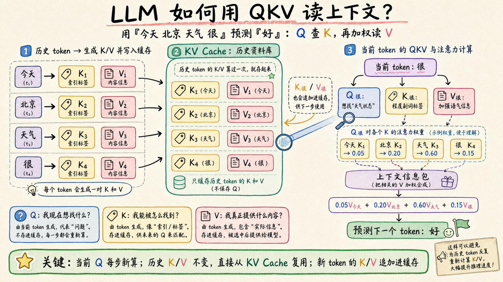

Prompt cache（提示缓存）是 API 服务方做的产品化：把"完全相同前缀的 K/V 向量"在自己的服务器里短期保留。下次请求开头部分和上次一样，就直接复用 K/V，只对新增部分收正常价钱，缓存部分按 10% 左右折扣计费。

以 5 分钟 TTL 为例。超过 5 分钟没有命中，缓存被清理掉。**长会话中断 1 小时再继续，比连续跑 10 分钟更贵。**

| 场景 | 上下文 | 新增 | 费用近似 |
| --- | --- | --- | --- |
| Cache hit | 100K | 1K | 100K × 0.1× + 1K × 1× ≈ 11K token 费用 |
| Cache miss | 100K | 1K | 101K × 1× = 101K token 费用 |

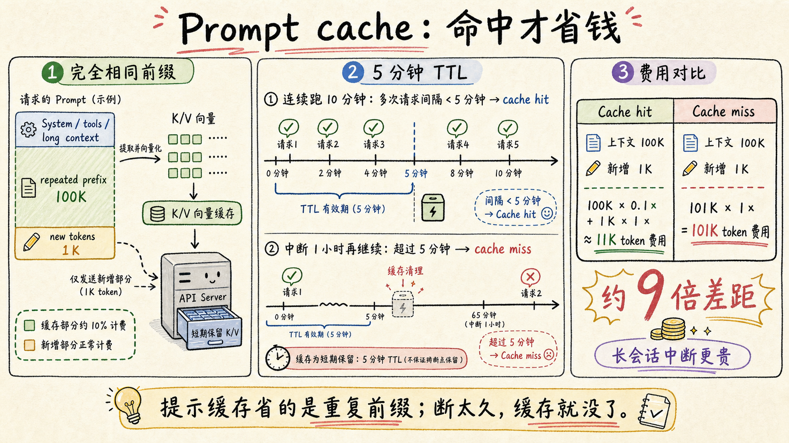

<Callout emoji="💡" color="green">

**使用技巧**

1. 避免 `/resume` 历史长会话接着聊，尽量拆出新 prompt 然后开新会话；
1. Subagent 是 cache 黑洞。每个 Subagent 是独立 prompt，不会复用主 agent 的 prompt cache。频繁 dispatch subagent 等于频繁 cache miss；
1. 自定义 system prompt 中不要放动态内容，prompt cache 只会对完全一致的前缀生效。

</Callout>
